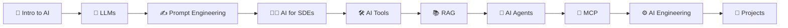

# 🚀 The Complete AI Guide — Beginner to Advanced

> 💬 "Time is the biggest currency." — This course is designed to respect your time. Every concept is explained with clarity and depth, so you learn the right things in the right order — no fluff, no filler. It is Based on the Namaste AI series by Akshay Saini.

---

### The Namaste AI Roadmap

This course is structured as a progressive journey from AI fundamentals to building production-ready AI applications:

### Season-by-Season Breakdown

| Season | Title                                    | What You'll Learn                                                                              |
| ------ | ---------------------------------------- | ---------------------------------------------------------------------------------------------- |
| **S1** | [Inside the Mind of AI](#season-1)       | How AI works — LLMs, tokens, embeddings, training, reasoning, & the full AI pipeline           |
| **S2** | [AI Native Software Engineer](#season-2) | How software engineers use AI tools to build smarter, write code faster, & solve problems      |
| **S3** | [Building AI Applications](#season-3)    | Build real AI-powered applications — integrate LLMs via APIs, build chat interfaces, & deploy  |
| **S4** | [Giving AI Knowledge (RAG)](#season-4)   | Retrieval Augmented Generation — give AI access to your own data, documents, & knowledge bases |
| **S5** | [From Chatbot to Agents](#season-5)      | Build autonomous AI agents that can reason, plan, use tools, & interact via MCP                |

---

# 📑 Table of Contents

## 🎬 [Season 1 — Inside the Mind of AI](#all-seasons)

#### Part I — AI Foundations & Concepts

| #   | Chapter                                                                                                   | Key Concepts                                                                                  |
| --- | --------------------------------------------------------------------------------------------------------- | --------------------------------------------------------------------------------------------- |
| 1   | [Welcome to Namaste AI](./S1%2001%20-%20Welcome%20to%20Namaste%20AI/Readme.md)                            | What is AI, Course roadmap, Overview of modern AI systems, Introduction to LLMs               |
| 2   | [Evolution of AI](./S1%2002%20-%20Evolution%20of%20AI/Readme.md)                                          | AI history, Major breakthroughs, Changing approaches, From early AI to ChatGPT and LLMs       |
| 3   | [Does Chat GPT knows or it Guess?](./S1%2003%20-%20Does%20Chat%20GPT%20knows%20or%20it%20guess/Readme.md) | LLM response generation, Prediction vs Knowledge, Hallucinations, Word sequence probability   |
| 4   | [The Secret Language of LLMs](./S1%2004%20-%20Secret%20Language%20of%20LLMs/Readme.md)                    | How LLMs process language, Text-to-representation transformation, Internal mechanisms of LLMs |
| 5   | [How Machine represents Meaning](./S1%2005%20-%20How%20Machine%20represents%20Meaning/Readme.md)          | Word embeddings, Numerical representations, Similarity and relationships, Pattern recognition |

#### Part II — Training, Computation & Reasoning

| #   | Chapter                                                                                            | Key Concepts                                                                                            |
| --- | -------------------------------------------------------------------------------------------------- | ------------------------------------------------------------------------------------------------------- |
| 6   | [Computational Brains of Machine](./S1%2006%20-%20Computational%20Brains%20of%20Machine/Readme.md) | Neural networks computation, Input-to-output transformation, Information processing in AI               |
| 7   | [Sharpening the Brain](./S1%2007%20-%20Sharpening%20the%20Brain/Readme.md)                         | Model training, Refinement process, Improving accuracy, Computational effort in training                |
| 8   | [Base Model to an AI Assistant](./S1%2008%20-%20Base%20Model%20to%20an%20AI%20Assistant/Readme.md) | Instruction tuning, Alignment, Prompting, From base model to interactive assistant                      |
| 9   | [Can AI Really Think](./S1%2009%20-%20Can%20AI%20Really%20Think/Readme.md)                         | AI reasoning, Pattern prediction vs thinking, Machine vs human intelligence, Understanding vs computing |

---

## 🎬 [Season 2 — AI Native Software Engineer](#all-seasons)

| #   | Chapter        | Key Concepts |
| --- | -------------- | ------------ |
| 10  | 🔜 Coming Soon | Coming Soon  |
| 11  | 🔜 Coming Soon | Coming Soon  |
| 12  | 🔜 Coming Soon | Coming Soon  |
| 13  | 🔜 Coming Soon | Coming Soon  |
| 14  | 🔜 Coming Soon | Coming Soon  |

---

## 🎬 [Season 3 — Building AI Application](#all-seasons)

| #   | Chapter        | Key Concepts |
| --- | -------------- | ------------ |
| 15  | 🔜 Coming Soon | Coming Soon  |
| 16  | 🔜 Coming Soon | Coming Soon  |
| 17  | 🔜 Coming Soon | Coming Soon  |
| 18  | 🔜 Coming Soon | Coming Soon  |
| 19  | 🔜 Coming Soon | Coming Soon  |

---

## 🎬 [Season 4 — Giving AI Knowledge (RAG)](#all-seasons)

| #   | Chapter        | Key Concepts |
| --- | -------------- | ------------ |
| 20  | 🔜 Coming Soon | Coming Soon  |
| 21  | 🔜 Coming Soon | Coming Soon  |
| 22  | 🔜 Coming Soon | Coming Soon  |
| 23  | 🔜 Coming Soon | Coming Soon  |
| 24  | 🔜 Coming Soon | Coming Soon  |

---

## 🎬 [Season 5 — From Chatbot to Agents](#all-seasons)

| #   | Chapter        | Key Concepts |
| --- | -------------- | ------------ |
| 25  | 🔜 Coming Soon | Coming Soon  |
| 26  | 🔜 Coming Soon | Coming Soon  |
| 27  | 🔜 Coming Soon | Coming Soon  |
| 28  | 🔜 Coming Soon | Coming Soon  |
| 29  | 🔜 Coming Soon | Coming Soon  |

---

### 🎉 You've completed the AI journey!

Generated with ❤️ for AI developers — happy coding!

