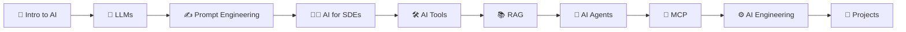

<div align="center">

|            ← Previous            | [⬆ Back to TOC](../README.md#part-1) |                                          Next →                                           |
| :------------------------------: | :-----------------------------------: | :---------------------------------------------------------------------------------------: |
| —                                |                                       | [Chapter 2: Evolution of AI](../S1%2002%20-%20Evolution%20of%20AI/Readme.md) |

</div>

---

# Chapter 1 — Welcome to Namaste AI &nbsp;

> **Season 1** | Part I — AI Foundations & Concepts
> [🎬Link](https://namastedev.com/learn/namaste-ai/welcome-to-namaste-ai)

---

### What is Artificial Intelligence?

**Artificial Intelligence (AI)** is the field of computer science focused on building systems that can perform tasks that typically require human intelligence — such as understanding language, recognizing images, making decisions, and generating content.

> 💡 AI is not a single technology — it's an umbrella term for a wide range of techniques, from simple rule-based systems to powerful neural networks that learn from data.

#### AI vs ML vs DL vs GenAI

Understanding the hierarchy of AI is essential before diving deeper:

| Term                              | What It Means                                                                                      | Example                                                    |
| --------------------------------- | -------------------------------------------------------------------------------------------------- | ---------------------------------------------------------- |
| **AI (Artificial Intelligence)**  | Broad field — any system that mimics human intelligence                                            | Siri, Chess engines, Self-driving cars                     |
| **ML (Machine Learning)**         | Subset of AI — systems that **learn from data** instead of being explicitly programmed             | Spam filters, Recommendation engines                       |
| **DL (Deep Learning)**            | Subset of ML — uses **neural networks** with many layers to learn complex patterns                 | Image recognition, Speech-to-text                          |
| **GenAI (Generative AI)**         | Subset of DL — models that **generate new content** (text, images, code, audio)                    | ChatGPT, DALL·E, GitHub Copilot                            |
| **LLM (Large Language Model)**    | A type of GenAI — massive models trained on text data to **understand and generate human language** | GPT-4, Claude, Gemini, LLaMA                               |

```
┌─────────────────────────────────────────────────┐
│              Artificial Intelligence            │
│                                                 │
│    ┌───────────────────────────────────────┐    │
│    │          Machine Learning             │    │
│    │                                       │    │
│    │    ┌─────────────────────────────┐    │    │
│    │    │       Deep Learning         │    │    │
│    │    │                             │    │    │
│    │    │    ┌───────────────────┐    │    │    │
│    │    │    │   Generative AI   │    │    │    │
│    │    │    │                   │    │    │    │
│    │    │    │   ┌───────────┐   │    │    │    │
│    │    │    │   │   LLMs    │   │    │    │    │
│    │    │    │   └───────────┘   │    │    │    │
│    │    │    └───────────────────┘    │    │    │
│    │    └─────────────────────────────┘    │    │
│    └───────────────────────────────────────┘    │
└─────────────────────────────────────────────────┘
```

### Why AI Matters Now

AI has been around since the 1950s, but several factors have made it explode in recent years:

| Factor                    | Why It Matters                                                                                          |
| ------------------------- | ------------------------------------------------------------------------------------------------------- |
| **Massive Data**          | The internet generates petabytes of text, images, and video — perfect training data for AI models       |
| **Compute Power (GPUs)**  | Modern GPUs (NVIDIA A100, H100) can train models with billions of parameters in weeks instead of years  |
| **Transformer Architecture** | The 2017 "Attention is All You Need" paper introduced Transformers — the backbone of every modern LLM |
| **Open-Source Models**    | Meta's LLaMA, Google's Gemma, Mistral — open models democratized access to powerful AI                  |
| **Developer Tools**       | APIs from OpenAI, Anthropic, Google make it easy for any developer to integrate AI into applications    |

> 💬 **"Time is the biggest currency."** — This course is designed to respect your time. Every concept is explained with clarity and depth, so you learn the *right things* in the *right order* — no fluff, no filler.

### The Namaste AI Roadmap

This course is structured as a progressive journey from AI fundamentals to building production-ready AI applications:



#### Season-by-Season Breakdown

| Season | Title                               | What You'll Learn                                                                               |
| ------ | ----------------------------------- | ----------------------------------------------------------------------------------------------- |
| **S1** | Inside the Mind of AI               | How AI works — LLMs, tokens, embeddings, training, reasoning, and the full AI pipeline          |
| **S2** | AI Native Software Engineer         | How software engineers use AI tools to build smarter, write code faster, and solve problems      |
| **S3** | Building AI Applications            | Build real AI-powered applications — integrate LLMs via APIs, build chat interfaces, and deploy  |
| **S4** | Giving AI Knowledge (RAG)           | Retrieval Augmented Generation — give AI access to your own data, documents, and knowledge bases |
| **S5** | From Chatbot to Agents              | Build autonomous AI agents that can reason, plan, use tools, and interact via MCP               |

#### Key Topics Covered in This Course

| Topic                        | What It Is                                                                                               |
| ---------------------------- | -------------------------------------------------------------------------------------------------------- |
| **LLMs**                     | Large Language Models — the AI models (GPT, Claude, Gemini) that understand and generate human language   |
| **Prompt Engineering**       | The art of writing effective instructions to get the best output from AI models                           |
| **AI for SDEs**              | How software engineers build AI-powered apps, integrate APIs, and solve real-world problems with AI      |
| **AI Tools**                 | New developer tools (Copilot, Cursor, v0) that are changing how software is built                        |
| **RAG**                      | Retrieval Augmented Generation — connecting AI to external knowledge sources for accurate, grounded answers |
| **AI Agents**                | Autonomous AI systems that can reason, plan, and take actions using tools                                |
| **MCP**                      | Model Context Protocol — a standard for connecting AI models to external tools and data sources           |
| **AI Engineering**           | The discipline of building, deploying, and maintaining production AI systems                              |

### How Modern AI Systems Work (High-Level)

At a very high level, here's what happens when you type a question into ChatGPT:

```
   You type: "Explain recursion in simple terms"
                    │
                    ▼
   ┌───────────────────────────────┐
   │   Tokenization                │   Your text is broken into tokens
   │   "Explain" "recurs" "ion"    │   (sub-word pieces the model understands)
   └──────────────┬────────────────┘
                  │
                  ▼
   ┌───────────────────────────────┐
   │   Embedding                   │   Each token is converted into a
   │   [0.12, -0.45, 0.78, ...]    │   high-dimensional number vector
   └──────────────┬────────────────┘
                  │
                  ▼
   ┌───────────────────────────────┐
   │   Transformer (LLM)           │   The model processes all tokens
   │   Attention + Feed-Forward    │   through layers of neural networks
   └──────────────┬────────────────┘
                  │
                  ▼
   ┌───────────────────────────────┐
   │   Prediction                  │   The model predicts the next token
   │   "Recursion" "is" "when"...  │   one at a time (autoregressive)
   └──────────────┬────────────────┘
                  │
                  ▼
   AI Response: "Recursion is when a function calls itself..."
```

> ⚠️ Each of these steps — tokenization, embeddings, transformers, and prediction — will be covered in depth in upcoming chapters (S1 03 through S1 09).

### Common Misconceptions

| Misconception                                         | Reality                                                                                                                                                    |
| ----------------------------------------------------- | ---------------------------------------------------------------------------------------------------------------------------------------------------------- |
| "AI and Machine Learning are the same thing"          | ❌ AI is the broad field; ML is a **subset** of AI that learns from data. Not all AI uses ML (e.g., rule-based expert systems)                             |
| "ChatGPT understands what it's saying"                | ❌ LLMs predict the **most likely next token** based on patterns learned from training data — they don't have understanding, consciousness, or beliefs      |
| "AI will replace all software developers"             | ❌ AI is a **tool that augments** developers. It automates repetitive tasks but still needs human judgment for architecture, debugging, and complex reasoning |
| "You need a PhD to work with AI"                      | ❌ Modern APIs (OpenAI, Anthropic, Google) let any developer **integrate AI** with a few lines of code. Deep math is needed to build models, not to use them |
| "AI = Chatbots"                                       | ❌ Chatbots are just one application. AI powers search engines, recommendation systems, self-driving cars, medical diagnosis, code generation, and much more |
| "Prompt Engineering is just asking questions nicely"   | ❌ It's a systematic discipline involving **context structuring, few-shot examples, chain-of-thought reasoning**, and output formatting for reliable results |
| "RAG and Fine-tuning are the same thing"              | ❌ RAG **retrieves** external data at query time; Fine-tuning **retrains** the model's weights. Different techniques for different use cases                |

<div style="font-size: 22px; color: red">
<details>
  <summary><strong>Interview Questions (Click to View)</strong></summary>
  <div style="font-size: 0.9rem; color: black; background:#fff; border:2px solid red; border-radius: 10px;">

- **Q: What is Artificial Intelligence?**
  - A: AI is the field of computer science focused on creating systems that can perform tasks requiring human intelligence — such as understanding language, recognizing patterns, making decisions, and generating content. It encompasses a range of techniques from rule-based systems to deep neural networks.

- **Q: What is the difference between AI, ML, and Deep Learning?**
  - A: AI is the broadest term — any system that mimics human intelligence. ML is a subset of AI where systems learn from data rather than being explicitly programmed. Deep Learning is a subset of ML that uses multi-layered neural networks to learn complex patterns from large datasets.

- **Q: What is a Large Language Model (LLM)?**
  - A: An LLM is a type of generative AI model trained on massive amounts of text data to understand and generate human language. Examples include GPT-4, Claude, Gemini, and LLaMA. They work by predicting the most likely next token in a sequence.

- **Q: What is Generative AI?**
  - A: Generative AI refers to AI models that can **create new content** — text, images, code, audio, or video — based on patterns learned from training data. LLMs (text), DALL·E (images), and Suno (music) are all examples of generative AI.

- **Q: What is Prompt Engineering?**
  - A: Prompt Engineering is the practice of crafting effective inputs (prompts) for AI models to get optimal outputs. It involves techniques like providing context, few-shot examples, chain-of-thought reasoning, and structured output formatting.

- **Q: What is RAG (Retrieval Augmented Generation)?**
  - A: RAG is a technique that combines an LLM with an external knowledge retrieval system. Instead of relying solely on training data, the model first **retrieves relevant documents** from a knowledge base, then uses that information to generate more accurate, grounded responses.

- **Q: What are AI Agents?**
  - A: AI Agents are autonomous AI systems that can reason about a task, create a plan, and take actions using external tools (APIs, databases, web search) to accomplish a goal. Unlike simple chatbots, agents can perform multi-step tasks with minimal human intervention.

- **Q: What is MCP (Model Context Protocol)?**
  - A: MCP is a standard protocol for connecting AI models to external tools and data sources. It provides a standardized interface for AI models to discover, connect to, and interact with tools, databases, and APIs — making AI applications more modular and interoperable.

- **Q: How does an LLM generate a response?**
  - A: An LLM generates responses by: (1) Tokenizing the input text into sub-word tokens, (2) Converting tokens into numerical embeddings, (3) Processing through transformer layers with attention mechanisms, (4) Predicting the next token one at a time (autoregressively) until the response is complete.

- **Q: What is the difference between RAG and Fine-tuning?**
  - A: RAG retrieves external knowledge **at query time** without modifying the model — it's flexible and cost-effective for adding domain-specific knowledge. Fine-tuning modifies the **model's weights** through additional training — it's better for changing the model's behavior, tone, or teaching specialized skills.

    </div>
  </details>
  </div>

### Key Takeaways

- **AI is an umbrella term** encompassing ML, Deep Learning, Generative AI, and LLMs — each is a progressively more specialized subset
- **LLMs** (like GPT, Claude, Gemini) are the foundation of modern AI — they predict the next token based on learned patterns, not actual understanding
- **"Time is the biggest currency"** — this course is designed to teach the right concepts in the right order, efficiently
- The **Namaste AI roadmap** covers: Intro → LLMs → Prompt Engineering → AI for SDEs → Tools → RAG → Agents → MCP → AI Engineering → Projects
- Modern AI exploded due to **massive data + GPU compute + Transformer architecture + open-source models + developer APIs**
- You don't need a PhD to build with AI — modern APIs let any developer integrate AI, but this course teaches you the **deep fundamentals** so you truly understand what's happening
- **RAG** gives AI access to your data; **Agents** give AI the ability to take actions; **MCP** standardizes how AI connects to tools
- Every concept in this course builds on the previous one — from understanding how AI "thinks" (Season 1) to building production AI apps (Seasons 3–5)

---

<div align="center">

|            ← Previous            | [⬆ Back to TOC](../README.md#part-1) |                                          Next →                                           |
| :------------------------------: | :-----------------------------------: | :---------------------------------------------------------------------------------------: |
| —                                |                                       | [Chapter 2: Evolution of AI](../S1%2002%20-%20Evolution%20of%20AI/Readme.md) |

</div>
