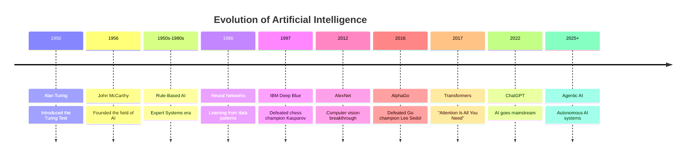

<div align="center">

|                                         ← Previous                                         | [⬆ Back to TOC](../README.md#part-1) |                                                      Next →                                                      |
| :----------------------------------------------------------------------------------------: | :----------------------------------: | :--------------------------------------------------------------------------------------------------------------: |
| [Chapter 1: Welcome to Namaste AI](../S1%2001%20-%20Welcome%20to%20Namaste%20AI/Readme.md) |                                      | [Chapter 3: Does ChatGPT Know or Guess?](../S1%2003%20-%20Does%20Chat%20GPT%20knows%20or%20it%20guess/Readme.md) |

</div>

---

# Chapter 2 — Evolution of AI &nbsp;

> **Season 1** | Part I — AI Foundations & Concepts
> [🎬Link](https://namastedev.com/learn/namaste-ai/the-evolution-of-ai)

---

### Topics Covering

> 1. What is Artificial Intelligence
> 2. Why AI was difficult for decades
> 3. Why Machine Learning became necessary
> 4. Why Deep Learning changed everything
> 5. How Transformers revolutionized AI
> 6. How LLMs became popular
> 7. Why Agentic AI is the next evolution

---

## 1. What is Artificial Intelligence?

_**Artificial Intelligence (AI) is a science of making machines perform tasks that normally require human intelligence.**_

It is the field of computer science focused on building systems that can perform tasks that typically require human intelligence — such as understanding language, recognizing images, making decisions, and generating content.

> 💡 AI is not a single technology — it's an umbrella term for a wide range of techniques, from simple rule-based systems to powerful neural networks that learn from data.

### Key Milestones in AI History



| Year            | Milestone                   | Significance                                                                                                                                               |
| --------------- | --------------------------- | ---------------------------------------------------------------------------------------------------------------------------------------------------------- |
| **1950**        | Alan Turing — Turing Test   | Introduced a seminal paper examining **machine thinking** capabilities                                                                                         |
| **1956**        | John McCarthy & Co-founders | **Established the field of AI**: _"Every aspect of learning and intelligence could, in principle, be described precisely enough for a machine to simulate it"_ |
| **1950s–1980s** | Rule-Based AI               | Domain experts designed manual **"Expert Systems"** with hardcoded logic                                                                                       |
| **1986**        | Neural Networks             | Computational systems started **discerning and learning directly from data** patterns                                                                          |
| **1997**        | IBM's Deep Blue             | Achieved a **historic victory over world chess champion** Garry Kasparov                                                                                       |
| **1990s**       | Machine Learning Era        | Algorithms that **learn from data** instead of following hardcoded rules                                                                                       |
| **2000s**       | Deep Learning Advancements  | **Multi-layered neural networks** for complex pattern recognition                                                                                              |
| **2012**        | AlexNet Breakthrough        | **Revolutionized computer vision** — machines could truly perceive visual information                                                                          |
| **2016**        | AlphaGo                     | Defeated world **Go champion Lee Sedol** — a game thought too complex for AI                                                                                   |
| **2017**        | Transformer Architecture    | **"Attention Is All You Need"** paper — the **backbone of every modern LLM**                                                                                   |
| **2022**        | ChatGPT Launch              | **AI goes mainstream** — conversational AI accessible to the general public                                                                                    |
| **2025+**       | Agentic AI                  | Rise of **autonomous AI systems** that reason, plan, and take actions                                                                                          |

---

## 2. Rule-Based AI Era (1950s–1980s) — Why AI Was Difficult for Decades

Under this early paradigm, intelligence was viewed merely as a **structured set of predefined rules**. Human experts built "Expert Systems" by manually coding vast rule bases to drive decision-making.

#### How Rule-Based AI Worked

```
   Problem: Is this email spam?

   ┌─────────────────────────────────────────────────┐
   │         RULE-BASED EXPERT SYSTEM               │
   │                                                 │
   │  IF email contains "FREE"       → SPAM ❌      │
   │  IF email contains "$$$"        → SPAM ❌       │
   │  IF email contains "LOTTERY"    → SPAM ❌      │
   │  IF email contains "WINNER"     → SPAM ❌       │
   │  ELSE                           → NOT SPAM ✅  │
   └─────────────────────────────────────────────────┘
```

#### Key Examples

| Domain                | Rule-Based Logic                                          | Limitation                                         |
| --------------------- | --------------------------------------------------------- | -------------------------------------------------- |
| **Spam Filtering**    | IF email contains "FREE", "$$$", "LOTTERY" → Flag as SPAM | Can't handle new spam patterns or context          |
| **Medical Diagnosis** | IF (Fever && Cold && Body Ache) THEN Diagnosis = FLU      | Can't handle edge cases or learn from new symptoms |

#### Why Rule-Based AI Hit a Wall

| Problem                     | Explanation                                                                            |
| --------------------------- | -------------------------------------------------------------------------------------- |
| **Manual Rules**            | Every single rule had to be written by human experts — doesn't scale                   |
| **No Learning**             | System can't improve on its own — needs manual updates for new patterns                |
| **Brittle**                 | Small variations break the rules (e.g., "FR33" instead of "FREE" bypasses spam filter) |
| **Combinatorial Explosion** | Real-world problems have too many variables for humans to write rules for              |

> ⚠️ Rule-based AI proved that **hardcoding intelligence doesn't scale**. The world needed machines that could **learn from data** — leading to the Machine Learning revolution.

---

## 3. Machine Learning (ML) — Why ML Became Necessary

**Machine Learning is a subset of AI that uses algorithms to analyze data, learn from it, and make decisions/predictions.**

| Approach                        | How It Works                          |
| ------------------------------- | ------------------------------------- |
| ❌ Traditional Rule-Based Logic | Human writes rules manually           |
| ✅ Data-Driven Learning (ML)    | Machine learns patterns from examples |

> 💡 **Image Classification**: Instead of writing rules for "what a cat looks like", you feed the model a million labeled photos and it **learns** to distinguish cats from dogs on its own.

#### ML Workflow

```
   Machine Learning Pipeline
   ─────────────────────────

   Input Data              Feature Extraction         ML Algorithm              Output
  (Structured)            (Manual by Humans)         (Learns patterns)        (Prediction)
      │                         │                         │                       │
      ▼                         ▼                         ▼                       ▼
  ┌─────────┐            ┌──────────────┐         ┌──────────────┐         ┌────────────┐
  │  Data   │     ──►    │   Extract    │   ──►   │ Decision Tree│   ──►   │  Cat 🐱    │
  │ (Images,│            │  Features    │         │ Random Forest│         │  or        │
  │  CSV,   │            │ (color, size,│         │ SVM, etc.    │         │  Dog 🐶    │
  │  Text)  │            │  edges...)   │         │              │         │            │
  └─────────┘            └──────────────┘         └──────────────┘         └────────────┘

                     ▲ Humans decide which
                       features matter
```

#### Key Features of ML

| Feature                 | Description                                             |
| ----------------------- | ------------------------------------------------------- |
| **Dataset Size**        | Requires smaller datasets compared to Deep Learning     |
| **Data Type**           | Works best with structured data (tables, CSVs)          |
| **Training Speed**      | Faster training — less compute required                 |
| **Feature Engineering** | Manual — humans must decide which features to extract   |
| **Algorithms**          | Decision Trees, Random Forest, SVM, K-Nearest Neighbors |

#### Real-World ML Examples

| Application                  | How ML Is Used                                                                 |
| ---------------------------- | ------------------------------------------------------------------------------ |
| **Spam Detection**           | Learns from thousands of labeled spam/not-spam emails — adapts to new patterns |
| **Housing Price Prediction** | Learns relationships between features (area, location, rooms) and price        |
| **Recommendation Engines**   | Netflix/Spotify learn your preferences from viewing/listening history          |

---

## 4. Deep Learning (DL) — Why DL Changed Everything

**Deep Learning is a specialized subset of ML based on Artificial Neural Networks (ANNs) inspired by the human brain.**

The key difference: **DL automatically learns features from raw data** — no manual feature engineering needed.

#### DL Workflow

```
   Deep Learning Pipeline
   ──────────────────────

   Input Data              Neural Network                              Output
  (Unstructured)          (Automatic Feature Learning)               (Prediction)
      │                         │                                       │
      ▼                         ▼                                       ▼
  ┌─────────┐     ┌─────────────────────────────────────┐        ┌────────────┐
  │  Raw    │     │  Input    Hidden Layers    Output   │        │  Cat 🐱    │
  │  Data   │ ──► │  Layer  ┌───┐┌───┐┌───┐   Layer     │  ──►   │  or        │
  │ (Image, │     │   ○──►  │ ○ ││ ○ ││ ○ │──► ○        │        │  Dog 🐶    │
  │  Audio, │     │   ○──►  │ ○ ││ ○ ││ ○ │──► ○        │        └────────────┘
  │  Text)  │     │   ○──►  │ ○ ││ ○ ││ ○ │──► ○        │
  └─────────┘     │         └───┘└───┘└───┘             │
                  │     Features learned automatically! │
                  └─────────────────────────────────────┘

                     ▲ Machine decides which
                       features matter
```

#### ML vs DL — Side-by-Side Comparison

| Aspect                   | Machine Learning (ML)            | Deep Learning (DL)                        |
| ------------------------ | -------------------------------- | ----------------------------------------- |
| **Dataset Size**         | Smaller datasets                 | Requires vast datasets (Big Data)         |
| **Data Type**            | Structured data (tables, CSV)    | Unstructured data (images, text, audio)   |
| **Feature Engineering**  | Manual — humans extract features | Automatic — model learns features         |
| **Compute Requirements** | CPU is sufficient                | Requires GPUs (computationally intensive) |
| **Training Speed**       | Faster                           | Slower (but more powerful)                |
| **Model Complexity**     | Simpler algorithms               | Multi-layered neural networks             |
| **Example**              | Spam filter, price prediction    | Image recognition, speech-to-text         |

#### Computer Vision Revolution

The introduction of the **ImageNet** dataset enabled the training of large-scale Deep Neural Networks, marking a major milestone in computer vision.

A key breakthrough occurred in **2012 with AlexNet**, developed by Alex Krizhevsky and his team. This advanced Deep Neural Network demonstrated that **machines could truly perceive visual information**.

| Application           | How DL Is Used                                                    |
| --------------------- | ----------------------------------------------------------------- |
| **Face Unlock**       | Deep neural networks recognize facial features for authentication |
| **Self-Driving Cars** | Computer vision processes real-time camera feeds for navigation   |
| **Medical Imaging**   | Analyzes X-rays and MRI scans for disease detection               |
| **Retail/Shopping**   | Product identification and visual search                          |

---

## 5. Transformers (2017) — How Transformers Revolutionized AI

Introduced in the landmark research paper **"Attention Is All You Need"**, the Transformer architecture stands as one of the most remarkable breakthroughs in the history of artificial intelligence.

> 💡 Modern AI systems — including **ChatGPT, Gemini, and Claude** — are fundamentally built upon the Transformer architecture and would not be possible without it.

#### Understanding Context & Self-Attention

Transformers excel at processing complex, **long-range dependencies** within text. Consider this example:

```
  "The lion did not cross the river because it cannot swim."
                                              ▲
                                              │
                                    What does "it" refer to?

  ┌──────────────────────────────────────────────────────────┐
  │                 SELF-ATTENTION MECHANISM                  │
  │                                                          │
  │   "The lion" ←───── HIGH ATTENTION ─────→ "it"           │
  │   "the river" ←──── LOW ATTENTION ──────→ "it"           │
  │                                                          │
  │   Result: "it" = "the lion" ✅  (not "the river")        │
  └──────────────────────────────────────────────────────────┘
```

The Transformer model dynamically determines that **"it" refers to "the lion"** rather than "the river", effectively capturing deep contextual relationships across the sentence.

#### Why Transformers Beat Previous Approaches

| Aspect                 | RNNs / LSTMs (Before)         | Transformers (After)                          |
| ---------------------- | ----------------------------- | --------------------------------------------- |
| **Processing**         | Sequential (word by word)     | Parallel (all words at once)                  |
| **Long-Range Context** | Struggles with long sentences | Handles long-range dependencies via attention |
| **Training Speed**     | Slow (can't parallelize)      | Fast (parallelizable on GPUs)                 |
| **Scalability**        | Limited by memory             | Scales to billions of parameters              |

---

## 6. Large Language Models (LLMs) & Generative AI — How LLMs Became Popular

**Large Language Models are built by combining Transformer architectures with extensive datasets processed on specialized GPU infrastructure.**

These advanced neural architectures are trained on vast datasets, leveraging self-attention mechanisms to analyze and resolve complex contextual relationships within text.

#### What It Takes to Build an LLM

| Requirement       | Description                                                           |
| ----------------- | --------------------------------------------------------------------- |
| **Architecture**  | Transformer-based neural network                                      |
| **Data**          | Trillions of tokens from the internet (books, websites, code, papers) |
| **Compute**       | Thousands of high-performance GPUs (NVIDIA A100, H100)                |
| **Training Time** | Weeks to months of continuous training                                |
| **Cost**          | Millions of dollars per training run                                  |

#### From Classification to Generation

| Earlier Models (Pre-LLM)         | Modern LLMs (Generative AI)           |
| -------------------------------- | ------------------------------------- |
| Classification (spam or not?)    | Multi-modal content generation        |
| Predictions (next purchase?)     | Text, code, images, audio, video      |
| Recommendations (what to watch?) | Creative writing, analysis, reasoning |

### The ChatGPT Moment (November 2022)

The release of ChatGPT marked a **pivotal milestone** that spearheaded the modern AI movement:

| Factor                       | Why It Mattered                                                                    |
| ---------------------------- | ---------------------------------------------------------------------------------- |
| **Conversational Interface** | Natural, intuitive dialogue interaction — anyone could use it                      |
| **Public Accessibility**     | Made advanced AI capabilities directly available to the general public             |
| **RLHF**                     | Reinforcement Learning from Human Feedback — fine-tuned to align with human intent |
| **Contextual Memory**        | Retained conversation history and maintained context throughout interaction        |

### Multimodal AI

Multimodal AI refers to systems capable of understanding, processing, and integrating information across multiple data types:

| Modality             | Examples                                     |
| -------------------- | -------------------------------------------- |
| **Visual Data**      | Images and video content                     |
| **Audio**            | Voice and sound recordings                   |
| **Text & Documents** | Multiple languages and structured documents  |
| **Code**             | Programming languages, debugging, generation |
| **Universal Inputs** | Virtually any other format of information    |

---

## 7. Where is the Industry Heading? — Why Agentic AI is the Next Evolution

The landscape of artificial intelligence is evolving rapidly. Here's where it's all going:

```
   The Future of AI
   ════════════════

   ┌────────────────┐     ┌─────────────────┐     ┌──────────────────────┐
   │  Agentic AI    │     │  Multimodal AI  │     │ Multi-Agent          │
   │  ──────────    │     │  ─────────────  │     │ Orchestration        │
   │  Autonomous    │     │  Process text,  │     │ ──────────────────   │
   │  goal-oriented │     │  images, audio, │     │ Multiple specialized │
   │  task execution│     │  video, code    │     │ agents working       │
   │                │     │  simultaneously │     │ together             │
   └────────────────┘     └─────────────────┘     └──────────────────────┘

   ┌────────────────┐     ┌─────────────────┐     ┌──────────────────────┐
   │ Reasoning      │     │  RAG            │     │ MCP / OKF            │
   │ Models         │     │  ───            │     │ ─────────            │
   │ ─────────────  │     │  Enhancing AI   │     │ Standardized         │
   │ Complex        │     │  with external  │     │ protocols for data   │
   │ problem-solving│     │  knowledge      │     │ and context          │
   │ and logic      │     │  retrieval      │     │ exchange             │
   └────────────────┘     └─────────────────┘     └──────────────────────┘

   ┌────────────────┐     ┌─────────────────┐
   │  Robotics      │     │ Cross-Industry  │
   │  ────────      │     │ Adoption        │
   │  Embodied AI   │     │ ──────────────  │
   │  physical      │     │ Deep integration│
   │  automation    │     │ across every    │
   │                │     │ sector          │
   └────────────────┘     └─────────────────┘
```

| Trend                         | Description                                                                             |
| ----------------------------- | --------------------------------------------------------------------------------------- |
| **Agentic AI**                | Autonomous systems designed for goal-oriented task execution                            |
| **Multimodal AI**             | Systems processing and integrating diverse data modalities — images, audio, text, video |
| **Multi-Agent Orchestration** | Frameworks for coordinating interactions among specialized AI agents                    |
| **Reasoning Models**          | Architectures optimized for complex problem-solving and logic (e.g., o1, o3)            |
| **RAG**                       | Enhancing model responses with external knowledge retrieval                             |
| **MCP / OKF**                 | Standardized protocols for data and context exchange between AI and tools               |
| **Robotics**                  | Embodied AI applications integrating physical automation                                |
| **Cross-Industry Adoption**   | Deep integration across every potential sector and vertical                             |

> ⚠️ These topics — RAG, Agents, MCP — will be covered in depth in **Seasons 3, 4, and 5** of this course.

---

### The Complete AI Evolution — At a Glance

```
   1950s              1990s              2000s              2017               2022              2025+
    │                  │                  │                  │                  │                  │
    ▼                  ▼                  ▼                  ▼                  ▼                  ▼
  Rule-Based    Machine Learning    Deep Learning     Transformers        GenAI/LLMs        Agentic AI
    AI               (ML)              (DL)           "Attention Is       ChatGPT          Autonomous
                                                     All You Need"       Moment            Systems
    │                  │                  │                  │                  │                  │
    │  Hardcoded       │  Learns from     │  Neural nets     │  Parallel        │  Generate        │  Reason,
    │  rules by        │  structured      │  learn from      │  attention on    │  text, code,     │  plan, and
    │  humans          │  data            │  raw data        │  all tokens      │  images          │  take actions
    │                  │                  │                  │                  │                  │
    ▼                  ▼                  ▼                  ▼                  ▼                  ▼
  ❌ Doesn't      ✅ Learns but     ✅ Auto feature    ✅ Long-range     ✅ Multi-modal    ✅ Tool use,
     scale          needs manual      learning from      context via        content            MCP, RAG,
                    features          unstructured       self-attention     generation         multi-agent
                                      data
```

---

### Common Misconceptions

| Misconception                                        | Reality                                                                                                                                                 |
| ---------------------------------------------------- | ------------------------------------------------------------------------------------------------------------------------------------------------------- |
| "AI was invented with ChatGPT"                       | ❌ AI has been around since **1950** (Turing Test). ChatGPT (2022) was a breakthrough in accessibility, not the invention of AI                         |
| "Machine Learning and Deep Learning are the same"    | ❌ ML is the broader field using algorithms on structured data; DL is a **subset** using multi-layered neural networks on unstructured data             |
| "Deep Learning doesn't need data"                    | ❌ DL requires **massive datasets** (Big Data) — the more data, the better the model performs                                                           |
| "Transformers process words one at a time like RNNs" | ❌ Transformers process **all tokens in parallel** using self-attention — that's why they're faster and more scalable                                   |
| "LLMs truly understand language"                     | ❌ LLMs are sophisticated **pattern matchers** — they predict the most likely next token, they don't have genuine understanding                         |
| "You need to build your own LLM to use AI"           | ❌ APIs from OpenAI, Anthropic, Google let you **integrate existing LLMs** with a few lines of code                                                     |
| "Rule-based AI is completely obsolete"               | ❌ Rule-based systems are still used in **regulatory compliance, business logic, and safety-critical systems** where deterministic behavior is required |
| "AI Agents are just chatbots with extra steps"       | ❌ Agents can **reason, plan, use tools, and take autonomous actions** — chatbots only respond to direct prompts                                        |

<div style="font-size: 22px; color: red">
<details>
  <summary><strong>Interview Questions (Click to View)</strong></summary>
  <div style="font-size: 0.9rem; color: black; background:#fff; border:2px solid red; border-radius: 10px;">

- **Q: Trace the key milestones in the evolution of AI.**
  - A: 1950 — Turing Test | 1956 — Field of AI founded by John McCarthy | 1950s–1980s — Rule-Based Expert Systems | 1986 — Neural Networks emerge | 1997 — Deep Blue defeats Kasparov | 2012 — AlexNet breakthrough in computer vision | 2016 — AlphaGo defeats Lee Sedol | 2017 — Transformer architecture ("Attention Is All You Need") | 2022 — ChatGPT launch | 2025+ — Rise of Agentic AI.

- **Q: What was wrong with Rule-Based AI? Why did it fail to scale?**
  - A: Rule-based AI required humans to manually write every rule. It couldn't learn from data, couldn't handle edge cases or variations, and suffered from combinatorial explosion — real-world problems have too many variables for humans to encode. It was brittle and couldn't adapt to new patterns.

- **Q: What is the difference between Machine Learning and Deep Learning?**
  - A: ML uses algorithms on **structured data** with **manual feature engineering** — humans decide which features matter. DL uses **multi-layered neural networks** on **unstructured data** (images, audio, text) with **automatic feature learning** — the model decides which features matter. DL requires more data and compute but is more powerful for complex tasks.

- **Q: What is a Transformer and why was it revolutionary?**
  - A: A Transformer is a neural network architecture introduced in 2017 ("Attention Is All You Need"). It uses **self-attention mechanisms** to process all tokens in parallel (unlike sequential RNNs), enabling it to capture long-range contextual relationships. It's faster to train, more scalable, and forms the backbone of all modern LLMs like GPT, Claude, and Gemini.

- **Q: Explain the self-attention mechanism with an example.**
  - A: In the sentence "The lion did not cross the river because it cannot swim", self-attention determines that "it" refers to "the lion" (not "the river") by computing attention scores between all word pairs. "The lion" gets **high attention** relative to "it", while "the river" gets **low attention** — allowing the model to resolve the reference correctly.

- **Q: What is an LLM and what does it require to build one?**
  - A: An LLM (Large Language Model) combines Transformer architecture with massive training datasets processed on specialized GPU infrastructure. Building one requires: a Transformer-based architecture, trillions of tokens of training data, thousands of GPUs, weeks of training time, and millions of dollars in compute costs.

- **Q: What made ChatGPT a breakthrough moment for AI?**
  - A: ChatGPT (Nov 2022) was a breakthrough because of: (1) Conversational interface — natural dialogue interaction, (2) Public accessibility — anyone could use it, (3) RLHF — Reinforcement Learning from Human Feedback aligned it with human intent, (4) Contextual memory — maintained conversation context. It made advanced AI accessible to the general public.

- **Q: What is Multimodal AI?**
  - A: Multimodal AI refers to systems that can understand, process, and integrate information across multiple data types — including text, images, audio, video, code, and documents — simultaneously. Modern models like GPT-4o and Gemini are multimodal.

- **Q: What is Agentic AI and how is it different from a chatbot?**
  - A: Agentic AI refers to autonomous AI systems that can **reason about a task, create a plan, use external tools** (APIs, databases, web search), **and take actions** to accomplish goals with minimal human intervention. Unlike chatbots that only respond to direct prompts, agents can perform multi-step tasks, make decisions, and interact with the real world.

- **Q: What is RLHF (Reinforcement Learning from Human Feedback)?**
  - A: RLHF is a training technique where human evaluators rate model outputs, and this feedback is used to fine-tune the model to better align with human preferences and expectations. It was a key factor in making ChatGPT's responses more helpful, harmless, and honest compared to the base GPT model.

- **Q: Compare Rule-Based AI, ML, DL, and Transformers.**
  - A: **Rule-Based AI** — hardcoded rules, no learning, brittle. **ML** — learns from structured data, manual features, smaller datasets. **DL** — learns from unstructured data, auto features, requires GPUs and big data. **Transformers** — parallel processing via self-attention, handles long-range context, scalable to billions of parameters — the foundation of modern LLMs.

    </div>
  </details>
  </div>

### Key Takeaways

- **AI has evolved through distinct eras**: Rule-Based AI → Machine Learning → Deep Learning → Transformers → LLMs/GenAI → Agentic AI
- **Rule-Based AI (1950s–1980s)** relied on hardcoded rules by human experts — brittle, didn't scale, couldn't learn
- **Machine Learning** introduced data-driven learning but required **manual feature engineering** on structured data
- **Deep Learning** eliminated manual feature engineering — neural networks **automatically learn features** from raw, unstructured data (images, audio, text)
- **Transformers (2017)** revolutionized AI with **parallel processing and self-attention** — enabling models to understand long-range context and scale to billions of parameters
- **LLMs** combine Transformers + massive data + GPU compute — they predict the next token, not "understand" language
- **ChatGPT (2022)** was the tipping point — making advanced AI **accessible to the general public** through a conversational interface + RLHF
- **Multimodal AI** processes text, images, audio, video, and code simultaneously
- The future is **Agentic AI** — autonomous systems that reason, plan, use tools (MCP), retrieve knowledge (RAG), and take actions
- Each era solved the limitations of the previous one: manual rules → data learning → automatic features → parallel attention → generation → autonomous action

---

<div align="center">

|                                         ← Previous                                         | [⬆ Back to TOC](../README.md#part-1) |                                                      Next →                                                      |
| :----------------------------------------------------------------------------------------: | :----------------------------------: | :--------------------------------------------------------------------------------------------------------------: |
| [Chapter 1: Welcome to Namaste AI](../S1%2001%20-%20Welcome%20to%20Namaste%20AI/Readme.md) |                                      | [Chapter 3: Does ChatGPT Know or Guess?](../S1%2003%20-%20Does%20Chat%20GPT%20knows%20or%20it%20guess/Readme.md) |

</div>
