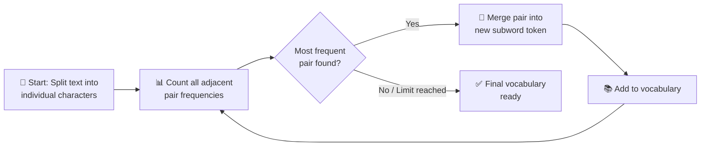

<div align="center">

|                                                    ← Previous                                                    | [⬆ Back to TOC](../README.md#part-1) |                                                    Next →                                                    |
| :--------------------------------------------------------------------------------------------------------------: | :----------------------------------: | :----------------------------------------------------------------------------------------------------------: |
| [Chapter 3: Does ChatGPT Know or Guess?](../S1%2003%20-%20Does%20Chat%20GPT%20knows%20or%20it%20guess/Readme.md) |                                      | [Chapter 5: How Machine Represents Meaning](../S1%2005%20-%20How%20Machine%20represents%20Meaning/Readme.md) |

</div>

---

# Chapter 4 — Secret Language of LLMs &nbsp;

> **Season 1** | Part I — AI Foundations & Concepts
> [🎬Link](https://namastedev.com/learn/namaste-ai/the-secret-language-of-llms)

---

### Topics Covering

> 1. What is a Token?
> 2. Words vs Characters vs Tokens
> 3. Subword Tokenization & Why It Matters
> 4. Vocabulary & Token IDs (with OpenAI Encodings)
> 5. Types of Tokenization (BPE, WordPiece, Unigram)
> 6. English vs Other Languages (Tokenization Fertility)
> 7. Context Window & Prompt Optimization

---

## 1. What is a Token?

> "A token is a **fundamental unit of text** created by a tokenizer."

Because computers cannot directly process words, text must be **broken down into smaller, manageable units** called tokens before being fed into a model.

#### Example of Tokenization

```
   Original Statement: "Namaste AI is amazing"

   Step 1: Text Breakdown (Tokens)
   ┌──────────┐  ┌──────┐  ┌──────┐  ┌──────────┐
   │ Namaste  │  │  AI  │  │  is  │  │ amazing  │
   └──────────┘  └──────┘  └──────┘  └──────────┘
       ↓              ↓         ↓          ↓
   Step 2: Mapping to Token IDs
   ┌──────────┐  ┌──────┐  ┌──────┐  ┌──────────┐
   │    78    │  │  12  │  │  37  │  │   108    │
   └──────────┘  └──────┘  └──────┘  └──────────┘
       ↓              ↓         ↓          ↓
   Step 3: Feed into Model
   ┌──────────────────────────────────────────────┐
   │           LLM (processes Token IDs)          │
   └──────────────────────────────────────────────┘
```

| Step                   | What Happens                             | Example                                        |
| ---------------------- | ---------------------------------------- | ---------------------------------------------- |
| **Text → Tokens**      | Text is split into words/sub-words       | "Namaste AI is amazing" → 4 tokens             |
| **Tokens → Token IDs** | Each token is mapped to a numerical ID   | [Namaste, AI, is, amazing] → [78, 12, 37, 108] |
| **Token IDs → LLM**    | Numerical sequence is fed into the model | [78, 12, 37, 108] → Model processes            |

---

## 2. Comparing Words, Characters, and Tokens

> While individual words frequently correspond to a single token, **complex or long words are often split into multiple sub-word tokens**.

#### Sample Text Analysis

```
   Sentence: "Many words map to one token, but some don't: indivisible."

   Character Count:  57 characters
   Token Count:      14 tokens

   Token Breakdown:
   ┌──────┬───────┬─────┬────┬─────┬───────┬───┬─────┬──────┬───────┬───┬──────────────┬───┐
   │ Many │ words │ map │ to │ one │ token │ , │ but │ some │ don't │ : │ indivisible  │ . │
   └──────┴───────┴─────┴────┴─────┴───────┴───┴─────┴──────┴───────┴───┴──────────────┴───┘

   Token IDs:
   [12488, 6391, 4014, 316, 1001, 6602, 11, 889, 1236, 4128, 25, 3862, 181386, 13]
```

-💡 **Key Insight**: Tokens ≠ Words. Punctuation gets its own token, contractions like "don't" are a single token, and long words like "indivisible" may become one or more tokens depending on the tokenizer.

- 🔗 **Interactive Demo**: Explore tokenization in real time with the [OpenAI Tokenizer Demo](https://platform.openai.com/tokenizer)

---

## 3. Subword Tokenization — Why Models Use It

> **Subword tokenization strikes an optimal balance** between two traditional approaches:

| Approach                    | Problem                               | Example                                     |
| --------------------------- | ------------------------------------- | ------------------------------------------- |
| **Word Tokenization**       | Excessively large vocabulary          | Every unique word = 1 vocabulary entry      |
| **Character Tokenization**  | Excessively long input sequences      | "hello" = 5 tokens: [h, e, l, l, o]         |
| ✅ **Subword Tokenization** | Balanced vocabulary & sequence length | "playing" = [play, ##ing] — reusable pieces |

#### Extreme Example

```
   Word: "Pneumonoultramicroscopicsilicovolcanoconiosis"
         (longest word in the dictionary — a lung disease caused by fine ash/dust)

   Characters: 45 characters
   Tokens:     15 tokens

   → The tokenizer breaks this massive word into 15 reusable sub-word pieces!
```

> 💡 **Key Takeaway**: Tokens can represent **full words, sub-words, or character combinations**. Subword tokenization avoids vocabulary explosion while keeping sequences manageable.

---

## 4. Vocabulary & Token IDs

> "The vocabulary is the **collection of tokens** that the tokenizer knows how to represent directly."

Every tokenizer has a vocabulary — a lookup table mapping text pieces to numerical IDs.

#### Simplified Tokenizer Vocabulary

| Token    | ID  |
| -------- | --- |
| "the"    | 10  |
| " is"    | 11  |
| "Java"   | 12  |
| "Script" | 13  |
| "."      | 14  |
| "ing"    | 15  |

> 🔗 **Developer Reference**: OpenAI implements tokenization via the [tiktoken](https://github.com/openai/tiktoken) library using **Byte Pair Encoding (BPE)**.

#### OpenAI Tokenization Examples

| Input Text                                                          | Characters | Tokens |
| ------------------------------------------------------------------- | ---------- | ------ |
| "OpenAI's large language models process text using tokens"          | 56         | **10** |
| "Qwkmajnsxhbakedlxiqjewhdaznqwdyxbvrhfmxqoskbvhefusdsdaaw" (random) | 56         | **30** |

> ⚠️ Same character count, **3x more tokens** for random text! Common English words are efficiently encoded; random strings are not.

#### Major OpenAI Encodings

| Encoding                  | Models                           | Vocab Size | Notes                                          |
| ------------------------- | -------------------------------- | ---------- | ---------------------------------------------- |
| **o200k_base**            | GPT-4o, newer flagship models    | ~200,000   | Better multilingual efficiency, expanded vocab |
| **cl100k_base**           | GPT-4, GPT-3.5-Turbo, embeddings | ~100,000   | Standard encoding for current-gen models       |
| **r50k_base / p50k_base** | text-davinci-003, Codex, GPT-3   | ~50,000    | Legacy encodings for older models              |

---

## 5. Types of Tokenization

### (A). Byte-Pair Encoding (BPE)

> "Byte-Pair Encoding (BPE) **repeatedly merges frequent neighbouring pieces**."

BPE is the most widely used subword tokenization algorithm in modern LLMs (GPT series). Originally a data compression algorithm, it was adapted for NLP.

#### How BPE Works



#### BPE Merge Example

```
   Training Text: "bug fun hug thug"

   Step 1: Start with characters
           b u g   f u n   h u g   t h u g

   Step 2: Count pairs → ("u","g") appears 3 times (most frequent)
   Step 3: Merge ("u","g") → "ug"
           b ug   f u n   h ug   t h ug

   Step 4: Count pairs → ("h","ug") appears 2 times (most frequent)
   Step 5: Merge ("h","ug") → "hug"
           b ug   f u n   hug   t hug

   ... continue until vocabulary size target is reached
```

| Step | Merge               | Result Token | Found In       |
| ---- | ------------------- | ------------ | -------------- |
| 1    | ("u", "g") → "ug"   | `ug`         | bug, hug, thug |
| 2    | ("u", "n") → "un"   | `un`         | fun            |
| 3    | ("h", "ug") → "hug" | `hug`        | hug, thug      |

#### Key Advantages of BPE

| Advantage                     | Explanation                                                                |
| ----------------------------- | -------------------------------------------------------------------------- |
| **Handles OOV Words**         | Unseen/rare words break down into known sub-words — no unknown word errors |
| **Optimized Sequence Length** | Common words/phrases map to single tokens — reduces memory usage           |
| **Balanced Vocabulary**       | Neither too large (word-level) nor too long sequences (char-level)         |

---

### (B). WordPiece Tokenization

> "Builds vocabulary pieces based on how **useful** they are for representing the training data, often using a **likelihood-based criterion**."

| Input     | Token Breakdown  | Notes                                    |
| --------- | ---------------- | ---------------------------------------- |
| "playing" | `play` + `##ing` | `##` prefix indicates continuation piece |
| "I"       | `I`              | Common words stay as single tokens       |

> 💡 Used by **BERT** and related models. Similar to BPE but selects merges based on likelihood improvement rather than raw frequency.

---

### (C). Unigram Tokenization

> "Begins with a **larger set of possible pieces** and gradually removes less useful ones — somewhat the exact **opposite of BPE**."

| Algorithm     | Approach                                         | Direction |
| ------------- | ------------------------------------------------ | --------- |
| **BPE**       | Starts small, **merges up** frequently           | Bottom-up |
| **WordPiece** | Starts small, merges based on **likelihood**     | Bottom-up |
| **Unigram**   | Starts large, **prunes down** less useful pieces | Top-down  |

> 💡 **Key Takeaway**: Rather than treating each entire word as a distinct entry, contemporary tokenizers segment unfamiliar text into **reusable subword components**.

---

## 6. English vs Other Languages — Tokenization Fertility

> "Two sentences with the **same meaning** do not necessarily have the **same token count**."

#### Cross-Language Token Comparison

| Language     | Sentence                                      | Characters | Tokens (GPT-4o / o1) | Tokens (GPT-4 / GPT-3.5) |
| ------------ | --------------------------------------------- | ---------- | -------------------- | ------------------------ |
| **English**  | I am learning artificial intelligence.        | 38         | **6**                | 6                        |
| **Hindi**    | मैं आर्टिफिशियल इंटेलिजेंस सीख रहा हूँ।       | 39         | **15**               | 15                       |
| **Hinglish** | Main artificial intelligence seekh raha hoon. | 45         | **9**                | 10                       |
| **Mixed**    | Artificial Intelligence सीख रहा हूँ।          | 36         | **6**                | 18                       |

> ⚠️ Hindi text produces **2.5x more tokens** than equivalent English text — directly impacting cost and context window usage!

#### Why Hinglish is Especially Interesting for Tokenization

| Characteristic               | Example                                  |
| ---------------------------- | ---------------------------------------- |
| **English vocabulary**       | Uses technical/global terms directly     |
| **Hindi grammar**            | Subject-Object-Verb word structure       |
| **Roman script**             | Latin characters instead of Devanagari   |
| **Informal spellings**       | High variation in phonetics and spelling |
| **Region-specific phrasing** | Colloquial idioms and local expressions  |

#### The "samjha" Problem — Spelling Variations

```
   Word root meaning "understand":

   samjha      ─┐
   samjhao     ─┤
   samjhaao    ─┤  All semantically equivalent to a human reader
   samjha do   ─┤  But EACH is a completely distinct character
   samjhaado   ─┘  sequence for the tokenizer
```

> ⚠️ Non-English or code-switched text often suffers from **higher token fragmentation** → increased token counts → higher cost → more context window consumption.

#### _What is Tokenization Fertility?_

**Tokenization fertility** measures how many tokens are produced for a word, character sequence, or linguistic unit.

| Fertility Level | Meaning                      | Impact                       |
| --------------- | ---------------------------- | ---------------------------- |
| **Low (≈1)**    | Word maps to ~1 token        | Efficient, cheaper           |
| **High (>2)**   | Word splits into many tokens | Expensive, uses more context |

> 💡 Higher fertility = text divided into more pieces = more expensive processing.

---

## 7. Context Window & Prompt Optimization

> "A context window is the **amount of tokenised information** a model can process within a request or active generation context."

**A language model does not have unlimited working memory.** Every model has a limit on how many tokens it can process at once — this is the **context window**.

#### What Consumes the Context Window?

```
   ┌─────────────────────────────────────────────────────────────┐
   │                    CONTEXT WINDOW                           │
   │                                                             │
   │  ┌───────────────────────┐  ┌────────────────────────────┐  │
   │  │      INPUT TOKENS     │  │     OUTPUT TOKENS          │  │
   │  │  ─────────────────    │  │  ────────────────────      │  │
   │  │  System instructions  │  │  Model's generated         │  │
   │  │  Your current prompt  │  │  response                  │  │
   │  │  Previous messages    │  │                            │  │
   │  │  Uploaded documents   │  │                            │  │
   │  │  Retrieved info (RAG) │  │                            │  │
   │  │  Tool outputs         │  │                            │  │
   │  └───────────────────────┘  └────────────────────────────┘  │
   │                                                             │
   │  📌 "Context window is SHARED between what you send        │
   │      and what the model generates."                         │
   └─────────────────────────────────────────────────────────────┘
```

#### Longer Prompts ≠ Better Results

> **Concise and clear instructions** often yield superior outcomes compared to overly verbose prompts, which consume unnecessary tokens and increase costs.

| Approach      | Prompt                                                                                                                                                                                                                                                      | Tokens | Verdict     |
| ------------- | ----------------------------------------------------------------------------------------------------------------------------------------------------------------------------------------------------------------------------------------------------------- | ------ | ----------- |
| **Concise**   | "Explain closures in JavaScript with one simple example."                                                                                                                                                                                                   | ~12    | ✅ Good     |
| **Verbose**   | "I want you to provide an explanation of the concept known as closures in the JavaScript programming language. Please ensure that your explanation is understandable and not too complicated. Also include an example that is simple and easy to follow..." | ~55    | ❌ Wasteful |
| **Optimized** | "Explain closures in JavaScript to a beginner who understands functions and scope but has never seen lexical environments. Use one example involving a counter. Keep it under 250 words."                                                                   | ~35    | ✅ Best     |

> 💡 **Key Insight**: Both the Concise and Verbose prompts convey the same fundamental request, but the Verbose version uses **~4.5x more tokens** for no quality gain. Excess tokens directly increase cost.

---

### Common Misconceptions

| Misconception                                | Reality                                                                                                                                       |
| -------------------------------------------- | --------------------------------------------------------------------------------------------------------------------------------------------- |
| "One token equals one word"                  | ❌ Tokens map to **sub-word units, punctuation, or spaces** — not full words. Complex/rare words split into multiple tokens                   |
| "Every model uses the same tokenizer"        | ❌ Different model families use **distinct tokenization algorithms** and vocabulary sets (o200k_base vs cl100k_base vs r50k_base)             |
| "Token ID represents meaning"                | ❌ A Token ID is just an **arbitrary integer index**. Semantic meaning is captured later in dense vector embeddings inside the neural network |
| "One visible emoji equals one token"         | ❌ Emojis often consist of **multiple Unicode code points** (skin tone, gender) — a single emoji can be **2 to 6+ tokens**                    |
| "A larger vocabulary is always better"       | ❌ Larger vocab reduces sequence length but **expands embedding/output layers** — higher memory overhead and compute cost                     |
| "Larger context means perfect memory"        | ❌ Models suffer from **attention degradation** ("lost in the middle" effect) — info in the middle of long inputs gets overlooked             |
| "More tokens always produce a better answer" | ❌ Excessive prompting increases **latency, cost, and hallucination risk** — concise, well-structured inputs yield superior quality           |

<div style="font-size: 22px; color: red">
<details>
  <summary><strong>Interview Questions (Click to View)</strong></summary>
  <div style="font-size: 0.9rem; color: black; background:#fff; border:2px solid red; border-radius: 10px;">

- **Q: What is a Token in the context of LLMs?**
  - A: A token is a **fundamental unit of text** created by a tokenizer. Since computers can't process words directly, text is broken into tokens (words, sub-words, or character combinations), converted to numerical Token IDs, and then fed into the model for processing.

- **Q: Why don't LLMs use word-level or character-level tokenization?**
  - A: **Word tokenization** creates an excessively large vocabulary (every unique word = 1 entry). **Character tokenization** creates excessively long sequences ("hello" = 5 tokens). **Subword tokenization** balances both — manageable vocabulary size AND reasonable sequence lengths.

- **Q: What is Byte-Pair Encoding (BPE)?**
  - A: BPE is a subword tokenization algorithm that starts with individual characters, counts adjacent pair frequencies, and **iteratively merges the most frequent pairs** into new tokens until reaching a target vocabulary size. It was originally a data compression algorithm adapted for NLP. Used by OpenAI's GPT models.

- **Q: How does BPE handle words it has never seen before?**
  - A: BPE breaks unseen/rare words into **known sub-word pieces**. Since the vocabulary contains reusable character combinations, any new word can be represented as a sequence of existing sub-word tokens — avoiding "unknown word" errors entirely.

- **Q: What is a Token ID?**
  - A: A Token ID is an **arbitrary integer index** pointing to an entry in the tokenizer's vocabulary lookup table. It has no inherent meaning — semantic meaning is only captured later when the ID is mapped into dense vector embedding space inside the neural network.

- **Q: What are OpenAI's major tokenizer encodings?**
  - A: **o200k_base** (~200K vocab) for GPT-4o and newer models with better multilingual support. **cl100k_base** (~100K vocab) for GPT-4 and GPT-3.5-Turbo. **r50k_base/p50k_base** (~50K vocab) for legacy models like GPT-3 and Codex.

- **Q: How does WordPiece differ from BPE?**
  - A: Both are bottom-up merge algorithms, but BPE merges based on **raw pair frequency**, while WordPiece merges based on **likelihood improvement** — selecting merges that most improve the model's ability to represent training data. WordPiece uses `##` prefix for continuation pieces (e.g., "playing" → `play` + `##ing`).

- **Q: What is Unigram tokenization and how does it differ from BPE?**
  - A: Unigram starts with a **large set of possible pieces** and gradually removes less useful ones — the **opposite** of BPE. BPE builds up (bottom-up merging), while Unigram prunes down (top-down removal).

- **Q: Why does the same sentence in Hindi produce more tokens than in English?**
  - A: Most tokenizers are **trained predominantly on English text**, so English words are efficiently encoded as single tokens. Non-English scripts (Hindi, Arabic, CJK) are under-represented in training data, causing **higher token fragmentation** — the same meaning requires 2-3x more tokens.

- **Q: What is Tokenization Fertility?**
  - A: Tokenization fertility measures **how many tokens are produced** for a word or character sequence. Higher fertility means more fragmentation → more tokens → higher processing cost → more context window consumption. Non-English text typically has higher fertility.

- **Q: What is a Context Window?**
  - A: The context window is the **maximum number of tokens a model can process** in a single request. It is **shared between input** (system instructions, prompt, conversation history, documents, tool outputs) **and output** (model's generated response). It is not unlimited memory.

- **Q: Why don't longer prompts always produce better results?**
  - A: Verbose prompts **waste tokens** without improving quality, directly increasing cost. They also consume more context window space, leaving less room for the model's response. Concise, well-structured prompts with clear constraints typically yield **superior output quality** at lower cost.

- **Q: What is the "lost in the middle" effect?**
  - A: Even with large context windows, models can suffer from **attention degradation** where information placed in the middle of long inputs is overlooked. Models tend to attend more to the beginning and end of context, making middle content less reliable.

    </div>
  </details>
  </div>

### Key Takeaways

- A **token** is the fundamental unit of text for LLMs — computers process Token IDs (numbers), not words
- Tokens can be **full words, sub-words, or character combinations** — they are NOT the same as words
- **Subword tokenization** (BPE, WordPiece, Unigram) balances vocabulary size and sequence length — avoiding the extremes of word-level and character-level approaches
- **BPE** (used by GPT models) iteratively merges the most frequent adjacent pairs — handles unseen words by breaking them into known sub-word pieces
- Every tokenizer has a **vocabulary** — a lookup table mapping text pieces to numerical Token IDs
- Token IDs are **arbitrary integers** — meaning is only captured later in vector embeddings
- **Different models use different encodings**: o200k_base (~200K vocab), cl100k_base (~100K), r50k_base (~50K)
- Non-English text produces **2-3x more tokens** than equivalent English text — higher cost and more context window usage
- **Tokenization fertility** measures how many tokens are produced per word — higher fertility = more expensive
- The **context window** is shared between input and output — it is not unlimited memory
- **Concise prompts beat verbose prompts** — excess tokens increase cost without improving quality
- Even large context windows suffer from **"lost in the middle"** attention degradation

---

<div align="center">

|                                                    ← Previous                                                    | [⬆ Back to TOC](../README.md#part-1) |                                                    Next →                                                    |
| :--------------------------------------------------------------------------------------------------------------: | :----------------------------------: | :----------------------------------------------------------------------------------------------------------: |
| [Chapter 3: Does ChatGPT Know or Guess?](../S1%2003%20-%20Does%20Chat%20GPT%20knows%20or%20it%20guess/Readme.md) |                                      | [Chapter 5: How Machine Represents Meaning](../S1%2005%20-%20How%20Machine%20represents%20Meaning/Readme.md) |

</div>
