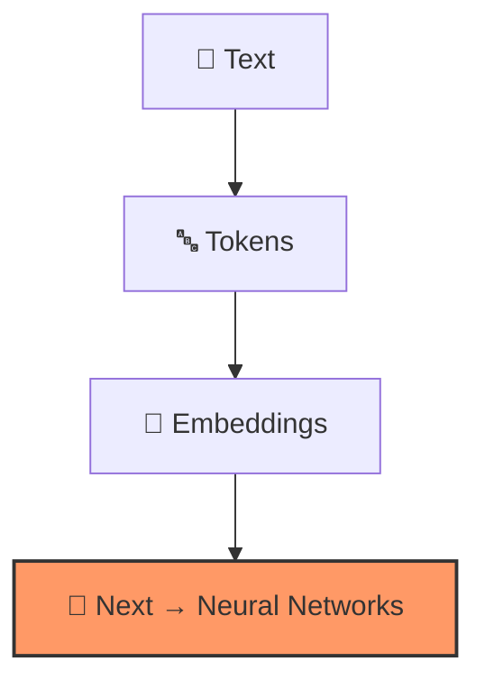

<div align="center">

|                                           ← Previous                                           | [⬆ Back to TOC](../README.md#part-1) |                                                     Next →                                                     |
| :--------------------------------------------------------------------------------------------: | :----------------------------------: | :------------------------------------------------------------------------------------------------------------: |
| [Chapter 4: Secret Language of LLMs](../S1%2004%20-%20Secret%20Language%20of%20LLMs/Readme.md) |                                      | [Chapter 6: Computational Brains of Machine](../S1%2006%20-%20Computational%20Brains%20of%20Machine/Readme.md) |

</div>

---

# Chapter 5 — How Machine Represents Meaning &nbsp;

> **Season 1** | Part I — AI Foundations & Concepts
> [🎬Link](https://namastedev.com/learn/namaste-ai/how-machines-represent-meaning)

---

### Topics Covering

> 1. Token IDs — Labels Without Meaning
> 2. Vectorisation
> 3. Embeddings
> 4. Dimensions in Embeddings
> 5. Semantic Similarity
> 6. Cosine Similarity
> 7. Token Embeddings (Token vs Text, Static vs Contextual, Contextualisation)
> 8. Bias in Embeddings
> 9. Real-World Applications of Embeddings

---

## 1. Token IDs — Labels Without Meaning

Machines process text by converting words into numerical identifiers known as **Token IDs**.

| Token  | Token ID |
| ------ | -------- |
| Dog    | 8123     |
| Mango  | 612      |
| Cat    | 123      |
| Grapes | 8521     |

While machines operate efficiently on these numbers, humans naturally understand the original tokens (words).

- → Token IDs **do not contain any meaning**
- → Token IDs are just some **labels associated with tokens**

> ⚠️ The number `8123` doesn't tell the machine that "Dog" is an animal, has four legs, or barks. It's just an arbitrary label — a lookup index in a vocabulary table.

---

## 2. Vectorisation

> "Vectorisation is the process of **converting information into numerical vectors**."
>
> [OR]
>
> "Vectorisation is the process of turning information into a form on which computers can **perform mathematical operations**."

#### Vector Representation

```
   [2, 5]                           → 2 dimensions
   [3, 8, 7]                        → 3 dimensions
   [0.12, -3.5, 4.20, 1.24, -6.81]  → 5 dimensions
```

Vectorisation can be applied to **Text, Images, Users, Products, or any information.**

#### Example: Ranking Fruits Based on 3 Properties

| Item       | Sweetness | Size | Crunchiness | Vector            |
| ---------- | --------- | ---- | ----------- | ----------------- |
| **Apple**  | 0.7       | 0.4  | 0.8         | `[0.7, 0.4, 0.8]` |
| **Banana** | 0.8       | 0.6  | 0.2         | `[0.8, 0.6, 0.2]` |
| **Carrot** | 0.2       | 0.5  | 0.9         | `[0.2, 0.5, 0.9]` |

> 💡 `[0.8, 0.6, 0.2]` — These numbers are **dimensions**. Modern embedding models use **thousands of dimensions** and those dimensions are **learned from data**.

---

## 3. Embeddings

> "An embedding is a **learned numerical representation** of an item that captures useful relationships with other items."

#### Embedding Examples

```
   king   → [0.81,  0.32, -0.52,  0.17]
   queen  → [0.79,  0.36, -0.48,  0.22]   ← Close to king (royalty relationship)
   banana → [-0.24, 0.91,  0.11, -0.63]   ← Far from king/queen (different category)
```

Here **king** and **queen** show a relationship (they are related) but **banana** is different — it's related to fruit, not royalty.

#### How Are Embeddings Created?

| Aspect                      | Explanation                                                                     |
| --------------------------- | ------------------------------------------------------------------------------- |
| **Not manually assigned**   | The model is NOT given these values by a human                                  |
| **Learned during training** | Embedding values are learned by observing how tokens are used                   |
| **Data-driven patterns**    | The system observes token usage across enormous amounts of text                 |
| **Emergent relationships**  | Words in similar linguistic environments develop useful numerical relationships |

> 💡 **Important Distinction**: "An embedding is **not the meaning** of a word. It is a **numerical representation that captures useful patterns** about that word."

#### Embeddings as Coordinates (2D Visualization)

```
        8 |                              ● JavaScript
          |                            ● Python
        7 |  ● king
          |  ● queen
        6 |
          |
        5 |
          |
        4 |            ● man
          |          ● woman
        3 |
          |                     ● banana
        2 |                   ● apple
          |____________________________________
             1    2    3    4    5    6    7    8
```

> Notice how related concepts **cluster together** — royalty (king, queen), people (man, woman), fruits (apple, banana), programming languages (JavaScript, Python).

---

## 4. Dimensions in Embeddings

```
   king → [1, 2, 6.24, -2.3, ...]   ← hundreds or thousands of values
```

> **More dimensions ≠ Higher intelligence**

Model-specific embeddings typically consist of **hundreds or even thousands** of distinct values. While higher dimensionality captures intricate data patterns, it necessitates increased storage and processing power.

#### The "Person" Analogy

| Representation | Dimensions Used                                                       | Depth of Profile |
| -------------- | --------------------------------------------------------------------- | ---------------- |
| **Basic 2D**   | Height, Weight                                                        | Very shallow     |
| **Richer nD**  | + Age, Profession, Location, Skills, Interests, Experience, Languages | Much deeper      |

The representation gains depth as dimensions are incorporated. Given the **extreme complexity of language**, embeddings rely on high-dimensional spaces to encode various linguistic patterns and semantic relationships.

#### Emergent Neighbourhoods

When embeddings are trained well, **related concepts often form neighbourhoods**:

| Cluster         | Examples                       |
| --------------- | ------------------------------ |
| **Royalty**     | king, queen, prince, crown     |
| **Programming** | JavaScript, Python, Java, code |
| **Foods**       | apple, banana, mango, grapes   |

But these neighbourhoods are **not manually programmed**. They **emerge from usage patterns** in data:

- _"The king ruled the kingdom."_
- _"The queen addressed the nation."_
- _"JavaScript is used for web development."_
- _"Python is popular for machine learning."_
- _"Apples and bananas are fruits."_

Through training, the numerical representations are adjusted so that useful relationships become encoded in the vector space. **It all depends on data.**

> 🔗 **Interactive Demo**: Explore embeddings in multiple dimensions with the [TensorFlow Embedding Projector](https://projector.tensorflow.org)

---

## 5. Semantic Similarity

> "Semantic similarity measures how **close two pieces of text are in meaning**."

#### Keyword vs Embedding-Based Search

| Query A                          | Query B                                                                    |
| -------------------------------- | -------------------------------------------------------------------------- |
| "How do I **centre** a **div**?" | "How can I **align** an **HTML element** in the **middle** of its parent?" |

A **keyword-based system** may struggle if it relies only on exact word overlap — these queries share almost no words!
An **embedding-based system** can represent both queries as vectors and discover that they are close in meaning.

#### Vector Direction & Similarity

```
   ←── A |  B ──→    Different directions → No similarity
   ←── A |  ←── B    Same direction (RL)  → Have similarity
   A ──→ |  B ──→    Same direction (LR)  → Have similarity
```

> 💡 If the **angle between two vectors is very small**, they also possess similarity — even if not perfectly aligned.

#### Examples of Semantic Similarity

| Pair | Sentence A                             | Sentence B                                         | Similarity |
| ---- | -------------------------------------- | -------------------------------------------------- | ---------- |
| ✅   | "How can I reset my password?"         | "I forgot my password. How do I create a new one?" | **High**   |
| ✅   | "The application crashes after login." | "The software closes immediately when I sign in."  | **High**   |
| ❌   | "How do I learn **Java**?"             | "How do I make **Java** coffee?"                   | **Low**    |

> The word "Java" appears in both sentences of the last pair, but the **meanings are completely different**. Embeddings allow systems to compare **broader meaning** rather than only matching identical words.

---

## 6. Cosine Similarity

> "Cosine similarity compares the **angle between two vectors**. It focuses more on **direction** than on absolute length."

If two vectors point in a similar direction, the represented concepts may be similar. If they point in unrelated directions, the concepts may be less similar.

#### Visualizing Cosine Similarity — 3 Cases

```
   SIMILAR (θ ≈ 0°)         ORTHOGONAL (θ ≈ 90°)       OPPOSITE (θ ≈ 180°)

      x                        x                             x
      ↑  / y                   ↑                             ↑
      | / θ (small)            |                             |
      |/                       |                        _____|_____
      └────→                   └────→ y                      |
                                                             ↓
   • Angle close to 0°       • Angle close to 90°           y
   • cos(θ) close to 1       • cos(θ) close to 0
   • Similar vectors          • Unrelated vectors        • Angle close to 180°
                                                          • cos(θ) close to -1
                                                          • Opposite vectors
```

#### Cosine Similarity Formula

```
   similarity(A, B) = cos(θ) = (A · B) / (||A|| × ||B||)

   Where:
   • θ       : The angle formed between vectors A and B
   • A · B   : Dot product = A₁B₁ + A₂B₂ + ... + AₙBₙ
   • ||A||   : Magnitude (L2 norm) of vector A
   • ||B||   : Magnitude (L2 norm) of vector B
```

#### Similarity Score Range

| Angle (θ) | cos(θ) | Interpretation                               |
| --------- | ------ | -------------------------------------------- |
| **0°**    | **1**  | Identical orientation — maximum similarity   |
| **90°**   | **0**  | Orthogonal/perpendicular — no alignment      |
| **180°**  | **-1** | Opposite orientation — maximum dissimilarity |

> 🔗 **Learn More**: [Cosine Similarity — LearnDataSci](https://www.learndatasci.com/glossary/cosine-similarity/)

#### ⚠️ Critical Distinction: Similarity ≠ Truth

> "Cosine similarity does **not possess an understanding of factual truth**."

- Statements that are entirely **false** may still exhibit high semantic similarity
- Instructions that are **harmful** can be closely related in the vector space
- Pieces of text can share a neighbourhood **even if they contradict each other**

| Statement A                                           | Statement B                                          | Similar? | True?    |
| ----------------------------------------------------- | ---------------------------------------------------- | -------- | -------- |
| "JavaScript is the **premier** programming language." | "JavaScript is a **terrible** programming language." | ✅ Yes   | ❓ Both? |

These sentences generate **similar embedding values** as both center on evaluations regarding the JavaScript ecosystem.

> → Embeddings are designed to **capture relationships**
> → They do **not** serve to validate **accuracy, safety, or underlying intent**

---

## 7. Token Embeddings

#### From Token ID to Meaningful Vector

```
   "I Love JavaScript"
        │
        ▼
   ┌────────┐  ┌────────┐  ┌──────────────┐
   │  "I"   │  │ "Love" │  │ "JavaScript" │
   └───┬────┘  └───┬────┘  └──────┬───────┘
       │           │              │
       ▼           ▼              ▼
   ┌────────┐  ┌────────┐  ┌──────────────┐
   │   12   │  │  214   │  │    18273     │    ← Token IDs (labels, NO meaning)
   └───┬────┘  └───┬────┘  └──────┬───────┘
       │           │              │
       ▼           ▼              ▼
   ┌────────────┐  ┌────────────┐  ┌────────────────────┐
   │[0.12,0.43, │  │[0.12,-0.32,│  │[0.12,-0.32, 0.08,  │  ← Embeddings
   │ 0.87, ...] │  │ 0.08, ...] │  │ ...]               │    (MEANINGFUL vectors)
   └────────────┘  └────────────┘  └────────────────────┘
```

This process replaces a **meaningless token ID** with a **dense numerical vector**. That vector becomes the model's **initial representation** of the token.

> ⚠️ The representation **may later change** as the model processes context.

#### Why Position Matters

```
   >> "Dog bites man"      ← Normal event
   >> "Man bites dog"      ← Newsworthy event!
```

Token embeddings alone identify **which** tokens are present, but the model also needs information about **order/position**. Models therefore incorporate **positional information** using architecture-specific techniques.

| Component                  | What It Tells the Model               |
| -------------------------- | ------------------------------------- |
| **Token Embedding**        | **Which** token is present (identity) |
| **Positional Information** | **Where** that token appears (order)  |

> 💡 The model needs both **identity and order**.

### (A). Token Embeddings vs Text Embeddings

| Aspect       | Token Embeddings                              | Text Embeddings                                                                     |
| ------------ | --------------------------------------------- | ----------------------------------------------------------------------------------- |
| **Scope**    | Individual tokens within a sequence           | Entire sentences, paragraphs, or documents                                          |
| **Purpose**  | Help an LLM **process a sequence internally** | Help applications **compare and retrieve content**                                  |
| **Used For** | Internal model computation                    | Search, Retrieval, Clustering, Recommendations, Classification, Duplicate Detection |

> 💡 The word "embedding" can refer to both, so always ask: **An embedding of what, and for which task?**

### (B). Static vs Contextual Meaning

```
   "I ate an Apple after lunch."        ← Apple = fruit 🍎
   "Apple released a new device."       ← Apple = company 🏢
```

A simple **static embedding** system assigns **one fixed vector** to the word "apple." That single vector must somehow represent both meanings — and that's a problem.

This is called **polysemy** — a word having **multiple meanings**. The meaning depends on context.

| Approach                 | How It Handles "apple"                          | Problem?             |
| ------------------------ | ----------------------------------------------- | -------------------- |
| **Static Embedding**     | One fixed vector for all uses                   | ❌ Can't distinguish |
| **Contextual Embedding** | Different vector depending on surrounding words | ✅ Context-aware     |

> Modern language models solve this using **contextual representations** — the representation of a token **changes based on the surrounding words**.

### (C). How Modern LLMs Handle Context — Contextualisation

| Word     | Context A                             | Context B                              | Context C                         |
| -------- | ------------------------------------- | -------------------------------------- | --------------------------------- |
| **bank** | "I deposited money in the **bank**."  | "We sat on the **bank** of the river." | —                                 |
| **bat**  | "He hit the ball with a **bat**."     | "A **bat** flew out of the cave."      | —                                 |
| **Java** | "**Java** is a programming language." | "**Java** is an island in Indonesia."  | "I ordered **Java** at the café." |

> → **Context modifies representation**


In a transformer-based language model, the token first receives an **initial token embedding**. Then the model processes it together with the **surrounding tokens**. Through multiple layers, the representation becomes **contextualised**.

> → The initial token may be the same. But after the model processes the complete sentence, its **internal representation changes according to context**.

---

## 8. Bias in Embeddings

> "Human-created data have a lot of flaws."

Human data contains:

| Source of Bias              | Example                                                       |
| --------------------------- | ------------------------------------------------------------- |
| **Cultural patterns**       | Western-centric views over-represented in training data       |
| **Historical inequalities** | Past gender/race biases reflected in text corpora             |
| **Stereotypes**             | Occupational stereotypes (e.g., "nurse" → female association) |
| **Representation gaps**     | Underrepresented languages, communities, or perspectives      |
| **Social biases**           | Socioeconomic assumptions embedded in language patterns       |

As a result, embeddings can also **encode undesirable associations**. For example, some occupations may become more closely associated with one gender because of patterns in the training data.

> ⚠️ **"Embeddings represent patterns in data that we may not want the system to reproduce."**

---

## 9. Real-World Applications of Embeddings

> "An embedding is a **general technique** for representing information numerically."

#### Keyword Search vs Embedding Search

| Feature                    | Keyword Search                                          | Embedding Search                                              |
| -------------------------- | ------------------------------------------------------- | ------------------------------------------------------------- |
| **Core Mechanism**         | Matches exact words or characters (literal overlap)     | Compares numerical vectors in high-dimensional space          |
| **Semantic Understanding** | Limited; struggles with synonyms and context            | High; captures relationships and intent behind words          |
| **Best Use Cases**         | Product IDs, error codes, legal clauses, specific names | Natural language queries, recommendations, semantic discovery |

> 💡 **Hybrid Search** combines both approaches to leverage their respective strengths.

#### Embedding Applications Across Domains

| Application                | Example Use Case                                                        |
| -------------------------- | ----------------------------------------------------------------------- |
| 🔍 **Semantic Search**     | Finding relevant results even with different wording                    |
| 🎯 **Recommendation**      | YouTube algorithm, social media feed curation                           |
| 📊 **Clustering**          | Grouping thousands of student questions, support tickets                |
| 📚 **RAG (Retrieval)**     | Similarity search in document chunks for LLM context                    |
| 🔄 **Duplicate Detection** | Identifying semantically equivalent content                             |
| 🏷️ **Classification**      | Categorizing support messages → Billing > Tech Support > Refunds > Auth |
| 🖼️ **Multi-Modal**         | Text-to-image search, image similarity, visual recommendations          |

---

### What We've Covered So Far



> _"How do we train the models? How do models learn?"_ — That's what comes next! 🚀

---

### Common Misconceptions

| Misconception                                            | Reality                                                                                                    |
| -------------------------------------------------------- | ---------------------------------------------------------------------------------------------------------- |
| "An embedding is a dictionary of tokens"                 | ❌ An embedding is a **numerical representation capturing learned relationships**                          |
| "Each dimension has one clear human meaning"             | ❌ Meaning is **distributed across many dimensions** — no single dimension = "sweetness" or "royalty"      |
| "Similar embeddings mean identical meaning"              | ❌ They may indicate **topic similarity, association, opposition, category membership**, or shared context |
| "Embedding similarity proves a statement is true"        | ❌ Similarity measures **relatedness, not truth**                                                          |
| "One embedding model works equally well for every task"  | ❌ Performance depends on **language, domain, data type, text length, training objective**, etc            |
| "Visual clusters perfectly represent the original space" | ❌ 2D and 3D projections **lose information** from the original high-dimensional space                     |
| "A larger embedding dimension is always better"          | ❌ Larger representations create **trade-offs in storage, latency, cost, and quality**                     |

<div style="font-size: 22px; color: red">
<details>
  <summary><strong>Interview Questions (Click to View)</strong></summary>
  <div style="font-size: 0.9rem; color: black; background:#fff; border:2px solid red; border-radius: 10px;">

- **Q: What is the difference between a Token ID and an Embedding?**
  - A: A **Token ID** is just an arbitrary integer label — a lookup index with no inherent meaning (`Dog = 8123`). An **embedding** is a dense numerical vector that captures learned relationships with other items (`Dog → [0.81, -0.32, 0.44, ...]`). Token IDs are labels; embeddings carry useful patterns.

- **Q: What is Vectorisation?**
  - A: Vectorisation is the process of **converting information into numerical vectors** — a form on which computers can perform mathematical operations. It can be applied to text, images, users, products, or any type of information.

- **Q: What is an Embedding and how is it created?**
  - A: An embedding is a **learned numerical representation** of an item that captures useful relationships with other items. It is NOT manually assigned by humans — the values are **learned during training** by observing how tokens are used across enormous amounts of text. Words appearing in similar linguistic environments develop similar numerical representations.

- **Q: What do "dimensions" mean in an embedding?**
  - A: Each number in an embedding vector is a **dimension**. Modern models use hundreds to thousands of dimensions to capture the extreme complexity of language. **More dimensions ≠ higher intelligence** — it's a trade-off between representational depth and computational cost.

- **Q: Why do related concepts cluster together in embedding space?**
  - A: Because the model repeatedly encounters these concepts in similar contexts during training. The king/queen cluster, programming language cluster, and fruit cluster are **not manually programmed** — they **emerge from usage patterns** in the training data.

- **Q: What is Semantic Similarity?**
  - A: Semantic similarity measures how **close two pieces of text are in meaning**. Unlike keyword matching (which requires exact word overlap), embedding-based similarity compares vector representations to discover that "How do I centre a div?" and "How can I align an HTML element in the middle?" mean the same thing.

- **Q: What is Cosine Similarity and how is it calculated?**
  - A: Cosine similarity compares the **angle between two vectors**, focusing on direction rather than magnitude. Formula: `cos(θ) = (A · B) / (||A|| × ||B||)`. Values range from **-1** (opposite) to **0** (unrelated) to **+1** (identical direction). It's the standard metric for comparing embeddings.

- **Q: Does high cosine similarity mean the statements are true?**
  - A: ❌ No. Cosine similarity measures **relatedness, not truth**. "JavaScript is the best language" and "JavaScript is a terrible language" can have HIGH similarity because both are about evaluating JavaScript. Similarity ≠ factual correctness.

- **Q: What is the difference between Token Embeddings and Text Embeddings?**
  - A: **Token embeddings** help an LLM process individual tokens within a sequence (internal model computation). **Text embeddings** represent entire sentences, paragraphs, or documents for tasks like search, retrieval, clustering, and recommendations. Always ask: _"An embedding of what, and for which task?"_

- **Q: What is Polysemy and how do modern LLMs handle it?**
  - A: **Polysemy** is when a word has multiple meanings (e.g., "bank" = financial institution OR riverbank). Static embeddings assign ONE fixed vector regardless of context — a problem. Modern transformer-based LLMs produce **contextual embeddings** where the same token gets different representations depending on surrounding words, through multiple transformer layers.

- **Q: How does contextualisation work in transformers?**
  - A: The token first receives an **initial embedding**, then the model processes it together with surrounding tokens through multiple transformer layers. Each layer refines the representation using **attention mechanisms**. By the final layer, "bank" in "I deposited money in the bank" has a completely different representation than "bank" in "We sat on the bank of the river."

- **Q: What is Bias in Embeddings and why does it matter?**
  - A: Human-created training data contains cultural patterns, historical inequalities, stereotypes, and representation gaps. Embeddings trained on this data can **encode these same undesirable associations** — for example, associating certain occupations more closely with one gender. Embeddings represent patterns in data that we may not want the system to reproduce.

- **Q: What are the main real-world applications of Embeddings?**
  - A: Embeddings power **semantic search** (finding results with different wording), **recommendations** (YouTube, social media), **clustering** (grouping support tickets), **RAG** (similarity search in document chunks), **duplicate detection**, **classification** (categorizing messages), and **multi-modal** applications (text-to-image search, visual recommendations).

- **Q: What is Hybrid Search?**
  - A: Hybrid search **combines keyword search and embedding search** to leverage both approaches. Keyword search excels at exact matches (product IDs, error codes), while embedding search captures semantic meaning. Together, they provide the most comprehensive search capability.

    </div>
  </details>
  </div>

### Key Takeaways

- **Token IDs are just labels** — arbitrary integer indices with no inherent meaning
- **Vectorisation** converts information into numerical vectors on which computers can perform mathematical operations
- An **embedding** is a learned numerical representation capturing useful relationships — NOT the meaning of a word
- Each number in a vector is a **dimension** — modern models use hundreds to thousands of dimensions
- Related concepts **cluster together** in embedding space — royalty, programming languages, foods form neighbourhoods
- These clusters are **not manually programmed** — they emerge from usage patterns in training data
- **Semantic similarity** measures closeness in meaning, not word overlap — "centre a div" ≈ "align an element in the middle"
- **Cosine similarity** compares vector direction: +1 (identical), 0 (unrelated), -1 (opposite) — but similarity ≠ truth
- **Token embeddings** are for internal LLM processing; **text embeddings** are for search, retrieval, and comparison tasks
- **Polysemy** (multiple word meanings) is handled by **contextual embeddings** — representation changes based on surrounding words
- Embeddings can **encode biases** from training data — cultural patterns, stereotypes, representation gaps
- Embeddings power **search, recommendations, clustering, RAG, classification, duplicate detection, and multi-modal** applications

---

<div align="center">

|                                           ← Previous                                           | [⬆ Back to TOC](../README.md#part-1) |                                                     Next →                                                     |
| :--------------------------------------------------------------------------------------------: | :----------------------------------: | :------------------------------------------------------------------------------------------------------------: |
| [Chapter 4: Secret Language of LLMs](../S1%2004%20-%20Secret%20Language%20of%20LLMs/Readme.md) |                                      | [Chapter 6: Computational Brains of Machine](../S1%2006%20-%20Computational%20Brains%20of%20Machine/Readme.md) |

</div>
