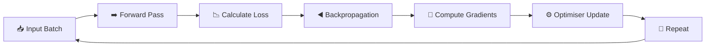

<div align="center">

|                                                   ← Previous                                                   | [⬆ Back to TOC](../README.md#part-2) |                                                     Next →                                                     |
| :------------------------------------------------------------------------------------------------------------: | :----------------------------------: | :------------------------------------------------------------------------------------------------------------: |
| [Chapter 6: Computational Brains of Machine](../S1%2006%20-%20Computational%20Brains%20of%20Machine/Readme.md) |                                      | [Chapter 8: Base Model to an AI Assistant](../S1%2008%20-%20Base%20Model%20to%20an%20AI%20Assistant/Readme.md) |

</div>

---

# Chapter 7 — Sharpening the Brain &nbsp;

> **Season 1** | Part II — Training, Computation & Reasoning
> [🎬Link](https://namastedev.com/learn/namaste-ai/sharpening-the-brain)

---

<a id="key-topics"></a>

### Topics Covering

> 1. [What "Learning" Means for a Machine](#topic-1)
> 2. [Parameters & Weights — The Model's Knobs](#topic-2)
> 3. [Loss Function](#topic-3)
> 4. [Backpropagation](#topic-4)
> 5. [Gradients](#topic-5)
> 6. [Gradient Descent & Learning Rate](#topic-6)
> 7. [Types of Gradient Descent](#topic-7)
> 8. [The Training Loop — Batches, Steps & Epochs](#topic-8)
> 9. [Self-Supervised Learning & Token Embeddings](#topic-9)
> 10. [Training vs Inference](#topic-10)
> 11. [Generalisation, Overfitting & Distributed Training](#topic-11)

---

<a id="topic-1"></a>

## 1. [What "Learning" Means for a Machine](#key-topics)

A neural network contains a vast collection of adjustable numbers known as **parameters**. Learning, in technical terms, means **adjusting these parameters so that future predictions become more accurate**.

The model does not acquire knowledge in a single step. It trains over **billions or trillions of samples**, slowly and steadily refining its internal values until it can generate useful outputs.

| Model   | Approximate Parameter Count    |
| ------- | ------------------------------ |
| GPT-3   | ~175 billion (175,000,000,000) |
| GPT-4/5 | Estimates suggest trillions+   |

### What the Model Learns Through Training

| Category                 | Description                                             |
| ------------------------ | ------------------------------------------------------- |
| **Word Sequences**       | Which words commonly appear together                    |
| **Grammar**              | Structural rules governing language                     |
| **Sentence Structure**   | How phrases and clauses are arranged                    |
| **Long-Range Relations** | Relationships between words across extended text inputs |

> 💡 There is no single "magical" update that makes a model intelligent. Useful behaviour emerges through **repeated optimisation** over enormous amounts of data.

---

<a id="topic-2"></a>

## 2. [Parameters & Weights — The Model's Knobs](#key-topics)

Think of the model as a massive control panel with billions of knobs. Each knob is a **parameter** — a tiny numerical value that influences whether the output improves or degrades.

### What Counts as a Parameter?

| Parameter Type                 | Examples                                                            |
| ------------------------------ | ------------------------------------------------------------------- |
| **Token Embeddings**           | Numerical vectors for each token                                    |
| **Attention Weights**          | W<sub>Q</sub>, W<sub>K</sub>, W<sub>V</sub>, W<sub>O</sub> matrices |
| **LayerNorm Parameters**       | γ (gamma), β (beta)                                                 |
| **Feed-Forward Network (FFN)** | W<sub>1</sub>, W<sub>2</sub>, bias vectors                          |

### Who Adjusts These Parameters?

The parameters are adjusted **automatically** through the training process — no human manually tunes billions of knobs.

```text
Training Data → Forward Pass → Prediction → Loss → Backprop → Optimisation → Updated Model
```

> ⚠️ **Parameters do not store knowledge like a database.** Knowledge is distributed as learned patterns across the entire network. Training data provides the examples; parameters are the values modified inside the network.

---

<a id="topic-3"></a>

## 3. [Loss Function](#key-topics)

A **loss function** is a numerical measure of how incorrect a prediction is. It converts prediction quality into a single number that the training process can optimise against.

| Prediction Quality        | Loss Value |
| ------------------------- | ---------- |
| Correct prediction        | **Low**    |
| Slightly wrong prediction | **Medium** |
| Very wrong prediction     | **High**   |

### Example

```text
Target Answer: "blue"

Scenario 1: Model predicts "blue" with 92% confidence  →  Loss = LOW  ✓
Scenario 2: Model predicts "banana" with 80% confidence →  Loss = HIGH ✗
```

> 💡 **Why do we need loss?** It provides a numerical signal telling the model exactly how far its prediction is from the desired target. The entire goal of optimisation is to **reduce this loss**.

---

<a id="topic-4"></a>

## 4. [Backpropagation](#key-topics)

**Backpropagation** calculates how changing each parameter would affect the loss. It starts from the error at the output and works **backward** through every layer of the network.

### Backpropagation Through Layers

```text
                          ◄─── ERROR FLOWS BACKWARD ───◄
                          │                             │
  ┌───────────┐     ┌─────────┐     ┌─────────┐     ┌─────────┐     ┌────────┐
  │   INPUT   │────►│ LAYER A │────►│ LAYER B │────►│ LAYER C │────►│ OUTPUT │
  │           │     │         │     │         │     │         │     │        │
  │The sky is │     │ weights │     │ weights │     │ weights │     │banana ✗│
  └───────────┘     └─────────┘     └─────────┘     └─────────┘     └────────┘
                       ▲               ▲               ▲
                       │               │               │
                    How much        How much        How much
                    did A's         did B's         did C's
                    weights         weights         weights
                    contribute?     contribute?     contribute?
```

### What Backpropagation Computes

For each layer and each individual weight, backpropagation determines the **sensitivity of the loss** to that parameter. These sensitivities are called **gradients**.

> ⚠️ **Backpropagation does NOT update the weights.** It only computes gradients. A separate optimisation algorithm uses those gradients to perform the actual parameter updates.

```text
LOSS  →  BACKPROP  →  GRADIENTS  →  OPTIMISER  →  UPDATED PARAMETERS
         (computes)   (sensitivities)  (updates)
```

---

<a id="topic-5"></a>

## 5. [Gradients](#key-topics)

A **gradient** tells us two critical pieces of information about each parameter:

| Information             | Description                                       |
| ----------------------- | ------------------------------------------------- |
| **Direction of Change** | Should this parameter increase or decrease?       |
| **Sensitivity**         | How strongly does this parameter affect the loss? |

### Example

```text
Current weight value: 0.40

Gradient analysis:
  • Increasing this weight → increases the loss  →  Move it DOWN  ↓
  • Decreasing this weight → decreases the loss  →  Confirmed: reduce it

Another weight:
  • Gradient indicates the opposite direction     →  Move it UP    ↑
```

Backpropagation computes these gradients for **every single parameter** across the entire network — from the output layer all the way back to the input embeddings.

> 💡 **Remember:** Gradient = **direction of change** + **sensitivity of the loss to that parameter**.

---

<a id="topic-6"></a>

## 6. [Gradient Descent & Learning Rate](#key-topics)

**Gradient descent** is an iterative optimisation algorithm that minimises the loss by adjusting parameters in the **opposite direction** of the gradient.

### Core Components

```text
Gradient Descent = Loss Function  +  Gradient  +  Learning Rate
```

### The Mountain Analogy

```text
                        ▲
                       /|\        YOU ARE HERE (current parameters)
                      / | \             ↓
                     /  |  \          ◆
                    /   |   \       ╱     ←── Gradient tells you
                   /    |    \    ╱            the slope direction
                  /     |     \ ╱
                 /      |      ◆  ← Step (controlled by learning rate)
                /       |     ╱ \
               /        |   ╱    \
              /         | ╱       \
             /          ◆          \       ←── Repeat until you
            /         ╱   \         \          reach the valley
           /        ╱       \        \
          /       ╱           \       \
    ─────◆──────────────────────◆──────────  ← VALLEY (minimum loss)
         ▲                      ▲
      Local                  Global
      Minimum                Minimum (Goal)
```

| Analogy Element     | Training Concept              |
| ------------------- | ----------------------------- |
| **Mountain height** | Loss value                    |
| **Slope direction** | Gradient                      |
| **Step size**       | Learning rate                 |
| **Valley bottom**   | Minimum loss (optimal model)  |
| **Thick fog**       | Cannot see the global picture |

### Learning Rate: The Step Size

| Learning Rate  | Effect                                                 |
| -------------- | ------------------------------------------------------ |
| **Too small**  | Training takes prohibitively long to converge          |
| **Too large**  | Algorithm overshoots the minimum and fails to converge |
| **Well-tuned** | Steady progress toward the minimum loss                |

> 💡 **Mental Model:** Gradient = direction + sensitivity. Learning rate = size of the step. Gradient descent = repeatedly take steps that aim to reduce the loss.

---

<a id="topic-7"></a>

## 7. [Types of Gradient Descent](#key-topics)

| Type  | Name                                  | How It Works                                                                                    | Challenge                                                                               |
| ----- | ------------------------------------- | ----------------------------------------------------------------------------------------------- | --------------------------------------------------------------------------------------- |
| **1** | **Batch Gradient Descent**            | Uses the **entire dataset** to compute the gradient for each step; stable but slow              | Computationally expensive on huge datasets                                              |
| **2** | **Stochastic Gradient Descent** (SGD) | Uses **one random sample** per step; fast but noisy                                             | High variance; updates fluctuate significantly                                          |
| **3** | **Mini-batch Gradient Descent**       | Splits the data into **small subsets (batches)**; practical balance between speed and stability | Local minima or saddle points can cause the system to get stuck where the slope is flat |

### Common Challenges in Optimisation

```text
┌──────────────────────────────────────────────────────────┐
│  Learning rate too small  →  Training takes forever      │
│  Learning rate too large  →  Overshoots the minimum      │
│  Flat/saddle region       →  Gradient ≈ 0, gets stuck    │
└──────────────────────────────────────────────────────────┘
```

> 💡 In practice, **mini-batch gradient descent** is the most widely used approach because it balances computational efficiency with update stability.

---

<a id="topic-8"></a>

## 8. [The Training Loop — Batches, Steps & Epochs](#key-topics)

### Key Terminology

| Term              | Definition                                                                                      |
| ----------------- | ----------------------------------------------------------------------------------------------- |
| **Dataset**       | The complete collection of all training examples                                                |
| **Batch**         | A group of examples processed together in a single forward pass                                 |
| **Training Step** | One optimisation update: process a batch → compute loss → compute gradients → update parameters |
| **Epoch**         | One complete pass through the entire training dataset                                           |

### Why Use Batches?

```text
Instead of:                        We process:
  example → update                   batch of examples → average loss → update
  example → update                   batch of examples → average loss → update
  example → update                   batch of examples → average loss → update
```

Batching reduces noise in the gradient estimate and allows efficient use of parallel computation (GPUs).

### The Complete Training Loop

```text
  ┌────────────────────────────────────────────────────────────────┐
  │                        THE TRAINING LOOP                       │
  │                                                                │
  │   ┌──────────┐   ┌──────────┐   ┌──────────┐   ┌──────────┐    │
  │   │  Sample  │──►│ Forward  │──►│Calculate │──►│ Backprop │    │
  │   │  / Batch │   │  Pass    │   │  Loss    │   │          │    │
  │   └──────────┘   └──────────┘   └──────────┘   └──────────┘    │
  │                                                      │         │
  │                                                      ▼         │
  │   ┌──────────┐   ┌──────────┐   ┌──────────┐   ┌──────────┐    │
  │   │  Better  │◄──│  Repeat  │◄──│Optimiser │◄──│Gradients │    │
  │   │  Model   │   │          │   │  Update  │   │          │    │
  │   └──────────┘   └──────────┘   └──────────┘   └──────────┘    │
  │                                                                │
  │   Repeat this loop over enormous amounts of data.              │
  │   This is what gradually "sharpens the brain."                 │
  └────────────────────────────────────────────────────────────────┘
```

### Epoch Workflow

```text
Dataset → Divide into Batches → Process Batch₁ → Update → Process Batch₂ → Update → ... → 1 Epoch
          ─────────────────────────────────────────────────────────────────────────────
                                    Repeat for multiple epochs
```

### Optimisation Loop (Mermaid)



> 💡 **Memory Trick:** Dataset = everything. Batch = group of examples. Training step = one update. Epoch = one full pass through the dataset.

---

<a id="topic-9"></a>

## 9. [Self-Supervised Learning & Token Embeddings](#key-topics)

### Self-Supervised Learning

The model learns from the data itself — no human needs to manually label every sentence. For language models, the **next token** becomes the target.

```text
Input:   "The sky is ___"
Target:   blue                ← derived directly from the sequence itself
```

The model predicts a target, calculates how wrong it was, and uses the training loop to improve. The key insight is that the **target comes directly from the sequence itself** — this is why it is called self-supervised.

> 💡 Neural networks do not learn a concept from one magical update. Useful behaviour emerges through repeated optimisation.

### Token Embeddings Are Also Parameters

Initially, the numbers inside an embedding table are not meaningful — they are random initializations.

```text
king  → [0.01, -0.04, 0.02, ...]     ← random at first
queen → [-0.03, 0.01, 0.06, ...]     ← random at first
```

During training, these embedding values are **parameters** that get adjusted alongside every other parameter in the network.

### How Embeddings Learn Meaning

| Step | What Happens                                                                   |
| ---- | ------------------------------------------------------------------------------ |
| 1    | Predictions produce loss                                                       |
| 2    | Backpropagation sends gradients through the entire model, including embeddings |
| 3    | Embedding values are adjusted along with all other parameters                  |
| 4    | After billions of samples, useful relationships and patterns emerge            |

> ⚠️ **Nobody manually places "king" next to "queen."** Embeddings learn meaningful relationships because better representations help the network make better predictions — which reduces loss.

---

<a id="topic-10"></a>

## 10. [Training vs Inference](#key-topics)

Training and inference share the **same forward-pass architecture** but differ fundamentally in purpose.

### Side-by-Side Comparison

```text
TRAINING                                    INFERENCE
────────────────────────────                ────────────────────────────
INPUT                                       INPUT
  │                                           │
  ▼                                           ▼
FORWARD PASS                                FORWARD PASS
  │                                           │
  ▼                                           ▼
PREDICTION                                  PREDICTION
  │                                           │
  ▼                                           ▼
LOSS CALCULATION                            OUTPUT  ✓  (done)
  │
  ▼
BACKPROPAGATION
  │
  ▼
GRADIENT COMPUTATION
  │
  ▼
PARAMETER UPDATE
```

### Key Differences

| Aspect               | Training                                           | Inference                                        |
| -------------------- | -------------------------------------------------- | ------------------------------------------------ |
| **Purpose**          | Learn and improve the model                        | Use the trained model to produce outputs         |
| **Forward Pass**     | ✓ Yes                                              | ✓ Yes                                            |
| **Loss Calculation** | ✓ Yes                                              | ✗ No                                             |
| **Backpropagation**  | ✓ Yes                                              | ✗ No                                             |
| **Parameter Update** | ✓ Yes — weights are modified                       | ✗ No — weights remain frozen                     |
| **Data Used**        | Training dataset                                   | User input / prompt                              |
| **Cost**             | Extremely expensive (weeks/months on GPU clusters) | Relatively cheap (single forward pass per token) |

> 💡 **One-Line Distinction:** Training = learning / changing the model. Inference = using the learned model to produce an output.

---

<a id="topic-11"></a>

## 11. [Generalisation, Overfitting & Distributed Training](#key-topics)

### Generalisation

**Generalisation** is the ability to perform well on examples the model did not directly memorise during training.

```text
Training data contains:            Model later encounters:
  • "The sky is blue."               "The clear afternoon sky looked..."
  • "The ocean is blue."                         │
  • "Grass is green."                            ▼
  • "Leaves are green."              Even without this exact sentence
                                     in training, a well-generalised
                                     model can still predict → "blue"
```

> 💡 **Good learning** = discovering patterns that remain useful beyond the exact training examples.

### Overfitting

**Overfitting** occurs when a model becomes extremely accurate on training examples but performs poorly on new, unseen data.

| Scenario                                                             | Result                               |
| -------------------------------------------------------------------- | ------------------------------------ |
| "The sky is blue." appears 10,000 times in training                  | Model memorises this exact sequence  |
| Model encounters: "On a clear summer afternoon, the sky appeared..." | Overfitted model fails to generalise |

> ⚠️ **Overfitting = memorising training examples instead of learning patterns that generalise.**

### Distributed Training

Training frontier-scale models is as much a **distributed-systems problem** as a machine-learning problem. Modern models are far too large for a single machine.

```text
  ┌───────────────────┐
  │  Machine / GPU 1  │────┐
  └───────────────────┘    │
  ┌───────────────────┐    │
  │  Machine / GPU 2  │────┼──► Shared Training Process
  └───────────────────┘    │    (synchronised parameter updates)
  ┌───────────────────┐    │
  │  Machine / GPU N  │────┘
  └───────────────────┘
```

Training is distributed across hundreds or thousands of GPUs, with each machine processing a portion of the data and synchronising parameter updates.

---

### Common Misconceptions

| Misconception                                             | Reality                                                                                                                                                 |
| --------------------------------------------------------- | ------------------------------------------------------------------------------------------------------------------------------------------------------- |
| ❌ "Backpropagation updates the weights"                  | ✅ Backpropagation only **computes gradients**. A separate optimiser algorithm performs the updates                                                     |
| ❌ "Parameters store knowledge like a database"           | ✅ Knowledge is **distributed as patterns** across the entire network, not stored in individual parameters                                              |
| ❌ "One training step makes the model intelligent"        | ✅ Intelligence emerges from **billions of repeated optimisation steps**, not a single update                                                           |
| ❌ "Higher learning rate always means faster learning"    | ✅ A learning rate that is too large causes the algorithm to **overshoot the minimum** and fail to converge                                             |
| ❌ "Self-supervised learning is the same as unsupervised" | ✅ Self-supervised learning **creates its own labels** from the data (e.g., next token). Unsupervised learning finds patterns without any labels at all |
| ❌ "Training and inference use different architectures"   | ✅ Both use the **same forward-pass architecture**. Training adds loss computation, backpropagation, and parameter updates on top                       |
| ❌ "Embeddings are manually designed to capture meaning"  | ✅ Embedding values are **parameters learned during training**. Better representations emerge because they help reduce loss                             |

---

<div style="font-size: 22px; color: red">
<details>
  <summary><strong>Interview Questions (Click to View)</strong></summary>
  <div style="font-size: 0.9rem; color: black; background:#fff; border:2px solid red; border-radius: 10px; padding: 20px;">

**Q1. What is the difference between trained and untrained output for "The sky is \_\_\_"?**

**A.** An untrained model produces random or nonsensical token predictions because its parameters are randomly initialised. A trained model, having optimised its parameters over billions of examples, assigns high probability to contextually appropriate tokens such as "blue."

---

**Q2. State the definition of "learning" for a neural network.**

**A.** Learning means adjusting the model's parameters through repeated optimisation so that future predictions become more accurate. It is not a single event but a gradual process driven by the training loop.

---

**Q3. How do the "knob" analogies explain parameters?**

**A.** Parameters are like knobs on a massive control panel. Each knob is a small numerical value. Turning a knob slightly (adjusting a parameter) can influence whether the model's output improves or worsens. The training process automatically adjusts all knobs to minimise prediction error.

---

**Q4. Which components of the Transformer architecture are identified as parameters?**

**A.** Token embedding vectors, attention weight matrices (W<sub>Q</sub>, W<sub>K</sub>, W<sub>V</sub>, W<sub>O</sub>), LayerNorm values (γ, β), and feed-forward network weights (W<sub>1</sub>, W<sub>2</sub>, biases). All of these are adjusted during training.

---

**Q5. How are distributed learned patterns different from database-like memory?**

**A.** A database stores discrete, retrievable records. A neural network distributes knowledge as patterns across billions of parameters. No single parameter "stores" a fact — instead, knowledge emerges from the collective interaction of parameters learned during training.

---

**Q6. What different roles do training data and parameters play?**

**A.** Training data provides the examples and targets that drive the learning process. Parameters are the internal numerical values of the model that get modified during training. Training data is consumed; parameters are what the model retains.

---

**Q7. What happens during a forward pass?**

**A.** The input is tokenised, converted to embeddings, passed through the neural network layers (attention, feed-forward, normalisation), and the model produces a probability distribution over the vocabulary for the next token.

---

**Q8. How does "blue" become a self-supervised target from "The sky is blue"?**

**A.** The sequence is shifted by one position. The input becomes "The sky is" and the target becomes "blue." The model learns to predict the next token from the preceding context — the label comes directly from the data itself, requiring no manual annotation.

---

**Q9. What does loss measure?**

**A.** Loss is a numerical value that quantifies how far the model's prediction is from the correct answer. A low loss means the prediction is close to the target; a high loss means the prediction is significantly wrong.

---

**Q10. Why is "blue = 2%, banana = 80%" a high-loss output?**

**A.** The correct answer is "blue," but the model assigns it only 2% probability while giving 80% to "banana." The loss function penalises this heavily because the model's confidence is concentrated on the wrong token.

---

**Q11. What does backpropagation compute as it travels backward through the layers?**

**A.** Backpropagation computes the gradient (partial derivative) of the loss with respect to each parameter. It determines how much each weight in each layer contributed to the prediction error, propagating this information from the output layer back to the input.

---

**Q12. What is a gradient in the context of neural network training?**

**A.** A gradient provides two pieces of information: the **direction** in which a parameter should change (increase or decrease) and the **sensitivity** of the loss to that parameter (how strongly a small change affects the loss).

---

**Q13. What is the difference between backpropagation and the optimiser?**

**A.** Backpropagation **computes** gradients — it determines how each parameter affects the loss. The optimiser **uses** those gradients to actually update the parameter values. Backpropagation is the analysis step; the optimiser is the action step.

---

**Q14. Define gradient descent.**

**A.** Gradient descent is an iterative optimisation algorithm that minimises a function (such as the loss) by adjusting parameters in the opposite direction of the gradient. It repeatedly takes steps toward lower loss, with each step proportional to the learning rate.

---

**Q15. What does the learning rate control?**

**A.** The learning rate controls the **size of each update step**. It determines how much the parameters change in response to the computed gradients. It is a critical hyperparameter that balances speed of convergence against stability.

---

**Q16. Map the mountain analogy elements to their training concepts.**

**A.**

| Mountain Element   | Training Concept             |
| ------------------ | ---------------------------- |
| Height on mountain | Loss value                   |
| Slope direction    | Gradient                     |
| Step size          | Learning rate                |
| Mountain bottom    | Minimum loss (optimal model) |
| Thick fog          | Cannot see global landscape  |

---

**Q17. Compare batch, stochastic, and mini-batch gradient descent.**

**A.**

| Type       | Data Per Step  | Stability   | Speed     |
| ---------- | -------------- | ----------- | --------- |
| Batch      | Entire dataset | High        | Slow      |
| Stochastic | One sample     | Low (noisy) | Fast      |
| Mini-batch | Small subset   | Moderate    | Practical |

Mini-batch gradient descent is the most commonly used in practice because it balances computational efficiency with gradient stability.

---

**Q18. What happens when the learning rate is too small or too large?**

**A.** Too small: training converges extremely slowly, potentially taking impractical amounts of time. Too large: the algorithm overshoots the minimum, oscillates wildly, and may fail to converge entirely.

---

**Q19. How can a flat or saddle region make optimisation difficult?**

**A.** In flat regions, the gradient approaches zero, giving the optimiser almost no signal about which direction to move. At saddle points, the gradient is zero but the point is neither a minimum nor a maximum — the optimiser can get stuck without making progress.

---

**Q20. Reconstruct the complete training loop in the correct order.**

**A.** Sample/Batch → Forward Pass → Calculate Loss → Backpropagation → Compute Gradients → Optimiser Update → Repeat. This cycle runs over enormous amounts of data across multiple epochs, gradually improving the model.

---

**Q21. Define: sample, dataset, batch, training step, epoch, and context window.**

**A.**

- **Sample:** A single training example
- **Dataset:** The complete collection of all training examples
- **Batch:** A group of samples processed together
- **Training step:** One optimisation update (process batch → loss → gradients → update)
- **Epoch:** One complete pass through the entire dataset
- **Context window:** The maximum number of tokens the model can process in a single forward pass

---

**Q22. Why is next-token pre-training called "self-supervised"?**

**A.** Because the training labels (targets) are generated automatically from the data itself. In next-token prediction, the target for each position is simply the next token in the sequence. No human annotator needs to provide labels — the supervision comes from the structure of the data.

---

**Q23. How do training and inference use the same forward architecture differently?**

**A.** Both execute the same forward pass through the same layers (embeddings → attention → FFN → output). During training, the forward pass is followed by loss computation, backpropagation, and parameter updates. During inference, only the forward pass executes — the model uses its frozen parameters to generate output without any learning.

  </div>
</details>
</div>

---

### Key Takeaways

- Learning means **adjusting parameters** to reduce future prediction error — not a single magical update.
- Parameters include **embeddings, attention weights, biases, normalisation values, and FFN projections**.
- Training data supplies examples and targets; parameters are the values modified inside the network.
- A **forward pass** predicts; the **loss function** measures how incorrect that prediction is.
- **Backpropagation** computes gradients; the **optimiser** applies the actual parameter updates.
- **Gradient descent** uses repeated steps toward lower loss, with the **learning rate** controlling step size.
- **Mini-batch gradient descent** is the most practical approach, balancing speed and stability.
- **Self-supervised** next-token learning derives its target from the sequence itself — no manual labelling.
- **Training** changes parameters; **inference** uses the trained parameters without modification.
- **Generalisation** transfers learned patterns to unseen examples; **overfitting** memorises training data instead.
- **Embeddings** are parameters too — meaningful relationships emerge because better representations reduce loss.
- Frontier-scale training is a **distributed systems** problem, requiring coordination across hundreds of GPUs.

---

<div align="center">

|                                                   ← Previous                                                   | [⬆ Back to TOC](../README.md#part-2) |                                                     Next →                                                     |
| :------------------------------------------------------------------------------------------------------------: | :----------------------------------: | :------------------------------------------------------------------------------------------------------------: |
| [Chapter 6: Computational Brains of Machine](../S1%2006%20-%20Computational%20Brains%20of%20Machine/Readme.md) |                                      | [Chapter 8: Base Model to an AI Assistant](../S1%2008%20-%20Base%20Model%20to%20an%20AI%20Assistant/Readme.md) |

</div>
