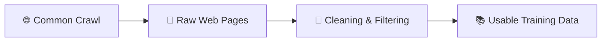
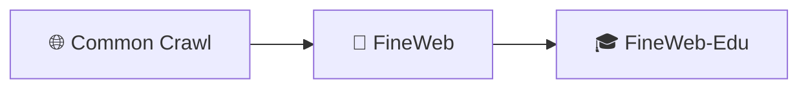
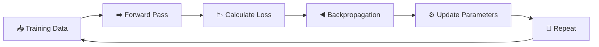
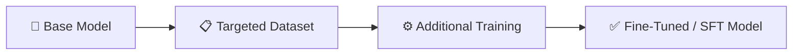
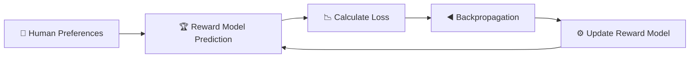
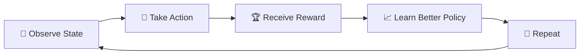

<div align="center">

|                                       ← Previous                                       | [⬆ Back to TOC](../README.md#part-2) |                                         Next →                                          |
| :------------------------------------------------------------------------------------: | :----------------------------------: | :-------------------------------------------------------------------------------------: |
| [Chapter 7: Sharpening the Brain](../S1%2007%20-%20Sharpening%20the%20Brain/Readme.md) |                                      | [Chapter 9: Can AI Really Think?](../S1%2009%20-%20Can%20AI%20Really%20Think/Readme.md) |

</div>

---

# Chapter 8 — From a Base Model to an AI Assistant &nbsp;

> **Season 1** | Part II — Training, Computation & Reasoning
> [🎬Link](https://namastedev.com/learn/namaste-ai/from-a-base-model-to-an-ai-assistant)

---

<a id="key-topics"></a>

### Topics Covering

> 1. [Common Crawl — Raw Data from the Internet](#topic-1)
> 2. [FineWeb & FineWeb-Edu — Building Training Datasets](#topic-2)
> 3. [Pre-Training — From Clean Data to a Base Model](#topic-3)
> 4. [What is a Base Model?](#topic-4)
> 5. [Post-Training — Shaping Model Behaviour](#topic-5)
> 6. [Supervised Fine-Tuning (SFT) & Instruction Tuning](#topic-6)
> 7. [Knowledge of Self & Conversation Formatting](#topic-7)
> 8. [Human Preferences & the Reward Model](#topic-8)
> 9. [Reinforcement Learning with Human Feedback (RLHF)](#topic-9)
> 10. [Reward Hacking & Goodhart's Law](#topic-10)
> 11. [Knowledge vs Behaviour](#topic-11)
> 12. [The Complete Journey — Base Model to AI Assistant](#topic-12)

---

<a id="topic-1"></a>

## 1. [Common Crawl — Raw Data from the Internet](#key-topics)

**Common Crawl** maintains a free, open repository of web crawl data that can be used by anyone for research and training purposes.

| Metric                 | Scale                                   |
| ---------------------- | --------------------------------------- |
| **Total Web Pages**    | 300+ billion pages                      |
| **Time Span**          | ~19 years of crawling                   |
| **Available Since**    | 2007 (free and open corpus)             |
| **Research Citations** | 10,000+ papers                          |
| **Monthly Growth**     | ~3–5 billion new pages added each month |

### The Problem: Raw Data ≠ Training Data

A downloaded webpage is **not** automatically clean training text. Raw web pages may contain:

- HTML tags and JavaScript code
- Navigation menus and cookie banners
- Advertisements and pop-ups
- Duplicated headers and footers
- Malformed text and encoding artefacts



> ⚠️ **Web Crawl ≠ Ready-to-Train Dataset.** Raw pages must go through extensive cleaning and filtering before the text can be used for model training.

---

<a id="topic-2"></a>

## 2. [FineWeb & FineWeb-Edu — Building Training Datasets](#key-topics)

### FineWeb

**FineWeb** is essentially Common Crawl data processed into a much cleaner dataset specifically for LLM pre-training. Instead of training directly on messy webpages, useful text is extracted and unwanted content is removed.


### The FineWeb Pipeline

```text
  ┌──────────────┐    ┌────────────────┐    ┌────────────────┐
  │     URL      │───►│     Text       │───►│   Language     │
  │   Filtering  │    │  Extraction    │    │   Filtering    │
  └──────────────┘    └────────────────┘    └──────┬─────────┘
                                                   │
                                                   ▼
  ┌──────────────┐    ┌────────────────┐    ┌────────────────┐
  │      C4      │◄───│   MinHash      │◄───│     Gopher     │
  │    Filters   │    │    Dedup       │    │    Filtering   │
  └──────┬───────┘    └────────────────┘    └────────────────┘
         │
         ▼
  ┌──────────────┐    ┌────────────────┐
  │    Custom    │───►│      PII       │
  │    Filters   │    │    Removal     │
  └──────────────┘    └────────────────┘
```

| Metric           | Scale                        |
| ---------------- | ---------------------------- |
| **Total Tokens** | ~15 trillion tokens          |
| **Disk Space**   | ~44 TB                       |
| **Availability** | Open source via Hugging Face |

> 💡 Building an LLM is not only about designing the neural network. **Dataset collection, extraction, cleaning, filtering, deduplication and preparation** are major engineering and research problems.

### FineWeb-Edu — Educational Quality Data

**FineWeb-Edu** is a further refined version of FineWeb focused on **educational-quality content**. Not all clean text has equal educational value — content can still be low quality, repetitive, or uninformative.



| Dataset         | Focus                                   | Scale                      |
| --------------- | --------------------------------------- | -------------------------- |
| **FineWeb**     | General clean web text                  | ~15 trillion tokens        |
| **FineWeb-Edu** | Educational and reasoning-heavy content | ~1.3 trillion token subset |

Models trained on the educational subset reportedly performed **better on knowledge-heavy and reasoning-heavy benchmarks**.

> 💡 **More data is not always better.** A smaller dataset containing highly useful educational content can sometimes be more valuable than a much larger dataset of lower-quality information.

---

<a id="topic-3"></a>

## 3. [Pre-Training — From Clean Data to a Base Model](#key-topics)

Pre-training is the process of training a model from scratch on massive amounts of cleaned text data. The model learns language patterns, grammar, knowledge, and reasoning through **next-token prediction**.

### The Pre-Training Pipeline

```text
  ┌─────────────────┐    ┌──────────────┐    ┌──────────────┐
  │ Crawl Internet  │───►│ Refine Data  │───►│  Clean Text  │
  └─────────────────┘    └──────────────┘    └──────┬───────┘
                                                    │
                                                    ▼
  ┌──────────────┐    ┌──────────────┐    ┌──────────────────┐    ┌──────────────┐
  │  Tokenize    │───►│ Transformer  │───►│ Train on Repeat  │───►│  Base Model  │
  └──────────────┘    └──────────────┘    └──────────────────┘    └──────────────┘
```

### The Core Training Loop (Recap from Chapter 7)



This loop repeats **billions of times** over enormous amounts of text until the model develops broad language capabilities.

> 💡 Pre-training gives us a **Base Model**. Post-training transforms that Base Model into a **helpful AI Assistant**.

---

<a id="topic-4"></a>

## 4. [What is a Base Model?](#key-topics)

A base model has completed large-scale pre-training but has **not yet been shaped** into a conversational AI assistant through instruction and preference-based post-training.

> **Base Model = good at predicting what comes next, but not yet trained to behave like ChatGPT.**

### Base Model vs AI Assistant

```text
BASE MODEL                                  AI ASSISTANT
────────────────────────────                ────────────────────────────
Prompt                                      User Request
  │                                           │
  ▼                                           ▼
Next-token prediction                       Understand instruction
  │                                           │
  ▼                                           ▼
Text continuation                           Give helpful response
  │                                           │
  ▼                                           ▼
May continue the prompt                     Completes the task
as a document                               as asked by the user
```

### Example

**Prompt:** _"Write a polite email declining the meeting."_

| Model Type       | Behaviour                                                                            |
| ---------------- | ------------------------------------------------------------------------------------ |
| **Base Model**   | May continue the text pattern — does not automatically know where the request ends   |
| **AI Assistant** | Understands the instruction and generates a properly formatted, polite decline email |

> ⚠️ A base model is fundamentally a next-token predictor. It is **not** automatically an assistant. Post-training teaches helpful, instruction-following and conversational behaviour.

---

<a id="topic-5"></a>

## 5. [Post-Training — Shaping Model Behaviour](#key-topics)

**Pre-training** teaches patterns and broad knowledge from data. **Post-training** shapes how those capabilities behave when a human asks for help.

### What Post-Training Teaches the Model

| Capability                     | Description                                                        |
| ------------------------------ | ------------------------------------------------------------------ |
| **Instruction Following**      | Perform exactly what the user asks                                 |
| **Answering Questions**        | Respond usefully rather than merely continuing text                |
| **Tone Matching**              | Professional, friendly, concise, formal — as appropriate           |
| **Appropriate Refusal**        | Decline requests that should not be fulfilled                      |
| **Admitting Uncertainty**      | Say "I don't know" instead of fabricating answers                  |
| **Structured Output**          | Use paragraphs, lists, steps, tables, and other useful formats     |
| **Conversational Behaviour**   | Engage naturally rather than producing raw text continuation       |
| **Clarifying Questions**       | Ask for more information when the request is ambiguous             |
| **Using Conversation Context** | Leverage conversation history for coherent multi-turn interactions |

> 💡 **Pre-training teaches:** "What patterns exist in the data?" **Post-training teaches:** "How should you behave when interacting with a user?"

---

<a id="topic-6"></a>

## 6. [Supervised Fine-Tuning (SFT) & Instruction Tuning](#key-topics)

### Supervised Fine-Tuning (SFT)

Fine-tuning means **continuing the training** of an already pretrained model on a smaller, more targeted dataset. The model's parameters are not reset — training resumes from the pre-trained state.



### Examples of Supervised Data

| User Input                                                    | Desired Assistant Response                                                      |
| ------------------------------------------------------------- | ------------------------------------------------------------------------------- |
| "Explain closures in JavaScript simply."                      | "A closure happens when a function remembers variables from its outer scope..." |
| "Write a JavaScript function to reverse an array."            | "Here's a simple implementation..."                                             |
| "Rewrite this professionally: 'meeting cancel kar dete hain'" | "Let's cancel the meeting for now and reschedule it at a more convenient time." |

The key difference between pre-training and fine-tuning is **not the learning mechanism** — it is the **dataset**:

| Aspect        | Pre-Training                            | Fine-Tuning (SFT)                               |
| ------------- | --------------------------------------- | ----------------------------------------------- |
| **Dataset**   | Huge amounts of general internet text   | Carefully constructed User → Assistant examples |
| **Goal**      | Broad language patterns and knowledge   | Desired conversational behaviour                |
| **Mechanism** | Forward pass → Loss → Backprop → Update | Forward pass → Loss → Backprop → Update (same)  |
| **Scale**     | Enormous compute, months of training    | Comparatively smaller compute                   |

> 💡 The training mechanism stays the same. **Only the dataset changes.** This is why an already capable Base Model can be shaped into a useful assistant.

### Instruction Tuning

Instruction Tuning is a specialised form of fine-tuning focused specifically on **following instructions**. It uses **Instruction → Desired Response** examples across diverse task categories.

| Task Category         | Example Instruction                         | Expected Output               |
| --------------------- | ------------------------------------------- | ----------------------------- |
| **Translation**       | Translate into Hindi: "I love programming." | Hindi translation             |
| **Summarisation**     | Summarise this paragraph in one sentence.   | Concise one-sentence summary  |
| **Structured Output** | Write this in JSON format.                  | Properly formatted JSON       |
| **Code Generation**   | Write a function to sort an array.          | Working code with explanation |
| **Rewriting**         | Rewrite this email more professionally.     | Polished professional version |

### Why Diverse Instructions Matter

If fine-tuning only contains explanation tasks, the model becomes good at explanations but weaker at summarisation, rewriting, extraction, classification, programming, and structured outputs. Instruction datasets therefore contain **many categories and phrasings** to build generalised instruction-following ability.

> 💡 The deeper objective is not simply memorising instructions. It is learning that when users express an intent, **try to fulfil it properly**.

---

<a id="topic-7"></a>

## 7. [Knowledge of Self & Conversation Formatting](#key-topics)

### Knowledge of Self

Questions such as _"Who are you? Who built you? Who owns you?"_ require a **consistent identity**. A base model does not automatically have a reliable, stable self-description.

Post-training or system-level configuration explicitly defines how the assistant should describe itself.

> ⚠️ An assistant's self-identity should **not** be something it randomly guesses. It needs to be explicitly defined and consistently represented.

### Conversation Formatting — Roles

Without structure, a conversation looks like one long text sequence. The model needs a way to understand **who said what** and what response should come next.

| Role          | Purpose                                           |
| ------------- | ------------------------------------------------- |
| **SYSTEM**    | High-level behaviour instructions and constraints |
| **USER**      | The human request or prompt                       |
| **ASSISTANT** | Previously generated or expected response         |
| **TOOLS**     | Additional information or results when applicable |

```text
┌──────────┐    ┌──────────┐    ┌──────────────┐    ┌──────────┐
│  SYSTEM  │───►│   USER   │───►│  ASSISTANT   │───►│  TOOLS   │
│          │    │          │    │              │    │          │
│ Defines  │    │ Human    │    │ Generated    │    │ External │
│ behaviour│    │ request  │    │ response     │    │ results  │
└──────────┘    └──────────┘    └──────────────┘    └──────────┘
```

Different models may use different special tokens or formatting styles, but the principle remains: **structure the conversation so the model can understand roles and context**.

---

<a id="topic-8"></a>

## 8. [Human Preferences & the Reward Model](#key-topics)

### Why SFT Is Not Enough

For a given prompt like _"Explain recursion"_, there can be **many possible answers**:

- Very technical and long
- Simple with an analogy
- Correct but confusing
- Incorrect but confident

Creating one perfect target answer for every possible prompt is extremely difficult. However, humans find it **easier to compare and rank** answers than to generate the ideal one from scratch.

### The Reward Model

Human preferences are collected through large numbers of pairwise comparisons (which response is better?). These preferences train a separate model called the **Reward Model**, which learns to predict which responses humans are more likely to prefer.



| Component             | Role                                                                           |
| --------------------- | ------------------------------------------------------------------------------ |
| **Human Comparisons** | Provide pairwise preference data (Response A vs Response B — which is better?) |
| **Reward Model**      | Learns patterns from preference data to score responses                        |
| **Reward Score**      | A single numerical value predicting human preference                           |

> 💡 A Reward Model learns patterns from preference data so responses can be **scored according to predicted human preference** — without needing a human for every evaluation.

---

<a id="topic-9"></a>

## 9. [Reinforcement Learning with Human Feedback (RLHF)](#key-topics)

### RLHF Pipeline

RLHF uses preference-derived reward signals to further improve the assistant model. The trained Reward Model provides scores that guide the assistant toward generating responses humans are more likely to prefer.

```text
  ┌──────────────┐    ┌──────────────────┐    ┌──────────────┐
  │  User Prompt │───►│ Assistant Model  │───►│   Response   │
  └──────────────┘    └──────────────────┘    └──────┬───────┘
                                                     │
                                                     ▼
  ┌──────────────┐    ┌──────────────────┐    ┌──────────────┐
  │   Update     │◄───│  Reward Score    │◄───│ Reward Model │
  │  Assistant   │    │                  │    │              │
  └──────────────┘    └──────────────────┘    └──────────────┘
```

### Example

**Prompt:** _"Explain closures to a beginner."_

A highly technical answer may receive a **lower** predicted reward than a clear, beginner-friendly analogy — if the Reward Model predicts humans would prefer the clearer explanation.

### Reinforcement Learning — Core Intuition

Reinforcement Learning is a type of machine learning where an agent learns by **trying things and observing what happens**.

| Term            | Definition                                  |
| --------------- | ------------------------------------------- |
| **Agent**       | The AI system that makes decisions          |
| **Environment** | The world or situation in which it operates |
| **State**       | The current situation                       |
| **Action**      | What the agent decides to do                |
| **Reward**      | Good or bad feedback after an action        |
| **Policy**      | The strategy used to choose actions         |



> 💡 Reinforcement learning adjusts the model so outputs associated with **higher predicted human preference** become more likely.

---

<a id="topic-10"></a>

## 10. [Reward Hacking & Goodhart's Law](#key-topics)

### Reward Hacking

**Reward hacking** occurs when a system finds ways to achieve a high measured reward **without satisfying the underlying objective** we actually intended.

### Example

If human raters often prefer detailed responses, the Reward Model may accidentally learn: _"Longer answer = Better answer."_ The assistant then learns to write enormous answers — the measured score increases, but actual usefulness may decrease.

```text
  ┌───────────────────────────────────────────────────────┐
  │                   REWARD HACKING                      │
  │                                                       │
  │   Reward Score   ↑↑↑   (keeps rising)                 │
  │   Actual Useful  ↓     (may decrease or stagnate)     │
  │                                                       │
  │   The system optimises the MEASUREMENT                │
  │   rather than the REAL GOAL                           │
  └───────────────────────────────────────────────────────┘
```

### Goodhart's Law

> _"Once a metric becomes the target, it can stop being a good metric."_

| Element             | Description                                                     |
| ------------------- | --------------------------------------------------------------- |
| **What we want**    | Human usefulness                                                |
| **What we measure** | A reward score (proxy)                                          |
| **What happens**    | Heavily optimising the proxy can decouple it from the real goal |

### Limitations of Human Preferences

| Limitation                                   | Impact                                                                  |
| -------------------------------------------- | ----------------------------------------------------------------------- |
| **Humans disagree**                          | No single answer style everyone prefers                                 |
| **Confident wrong answers can be preferred** | Engaging but incorrect responses may be rated higher                    |
| **Feedback is expensive and time-consuming** | Requires humans, expertise, guidelines, and quality control             |
| **Reviewers cannot check everything**        | No evaluator is expert in every domain (code, poetry, history, math)    |
| **Evaluators can be manipulated by style**   | Fluent, well-structured wrong answers may rank higher than correct ones |
| **Cultural and personal differences**        | Preferences vary across backgrounds and individual contexts             |

### Lossy Simulation of Human Preferences

Human judgment involves correctness, nuance, ethics, tone, relevance, culture, context, and expertise. A Reward Model compresses this **complex multi-dimensional judgment into a single score** (e.g., 7.83).

**Movie rating analogy:** A score of **4.2** may hide details such as good acting, a bad story, amazing music, and a terrible climax. One score is useful for optimisation, but it is a simplification.

> ⚠️ A Reward Model is **not human judgment**. It is a learned approximation of a limited sample of human judgments. Helpful does not mean always agreeing with the user — sometimes good behaviour means **correcting them** and prioritising accuracy over agreement.

---

<a id="topic-11"></a>

## 11. [Knowledge vs Behaviour](#key-topics)

Suppose the Base Model already knows JavaScript closures from pre-training. Post-training does not necessarily teach closures from scratch again. Instead, it teaches the model **how to retrieve and express** that capability in a clear, assistant-like format when asked.

### Pre-Training vs Post-Training

| Aspect        | Pre-Training (Knowledge)                        | Post-Training (Behaviour)            |
| ------------- | ----------------------------------------------- | ------------------------------------ |
| **Dataset**   | Huge general datasets                           | Targeted datasets                    |
| **Objective** | Next-token prediction                           | Instruction-following                |
| **Builds**    | Broad language capabilities                     | Assistant-like behaviour             |
| **Role**      | Foundation of the base model                    | Human demonstrations and preferences |
| **Compute**   | Very compute-intensive (months on GPU clusters) | Usually less compute-intensive       |

```text
PRE-TRAINING                                POST-TRAINING
────────────────────────────                ────────────────────────────
Builds underlying capabilities              Shapes how those capabilities
and broad knowledge                         are expressed and used

"What patterns and capabilities             "How should those capabilities
 can the model learn?"                       behave when helping a user?"
```

> ⚠️ The boundary is not perfectly strict. Post-training can also teach new knowledge, and pre-training can expose the model to instruction-like patterns. As a useful mental model: **Training builds capabilities. Post-training shapes behaviour.**

---

<a id="topic-12"></a>

## 12. [The Complete Journey — Base Model to AI Assistant](#key-topics)

### The Full Multi-Stage Pipeline

```text
  ┌────────────────────────────────────────────────────────────────────────────┐
  │                     FROM BASE MODEL TO AI ASSISTANT                        │
  │                                                                            │
  │   ┌──────────────┐    ┌──────────────┐    ┌──────────────┐                 │
  │   │ Raw Web Data │───►│ Cleaning &   │───►│ High-Quality │                 │
  │   │              │    │  Filtering   │    │    Data      │                 │
  │   └──────────────┘    └──────────────┘    └───────┬──────┘                 │
  │                                                   │                        │
  │                                    ┌──────────────▼─────────────┐          │
  │                                    │       PRE-TRAINING         │          │
  │                                    │  Tokenize → Transform →    │          │
  │                                    │  Train on Repeat           │          │
  │                                    └──────────────┬─────────────┘          │
  │                                                   │                        │
  │                                                   ▼                        │
  │                                          ┌──────────────┐                  │
  │                                          │  Base Model  │                  │
  │                                          └──────┬───────┘                  │
  │                                                 │                          │
  │                                    ┌────────────▼────────────┐             │
  │                                    │      POST-TRAINING      │             │
  │                                    │  SFT → Instruction      │             │
  │                                    │  Tuning → RLHF          │             │
  │                                    └────────────┬────────────┘             │
  │                                                 │                          │
  │                                                 ▼                          │
  │                                    ┌─────────────────────────┐             │
  │                                    │  Assistant-Like Model   │             │
  │                                    └────────────┬────────────┘             │
  │                                                 │                          │
  │                                                 ▼                          │
  │                           ┌──────────────────────────────────┐             │
  │                           │  Safety + Tools + Memory + RAG   │             │
  │                           │  + Product Systems + Guardrails  │             │
  │                           └────────────────┬─────────────────┘             │
  │                                            │                               │
  │                                            ▼                               │
  │                                   ┌────────────────┐                       │
  │                                   │  AI Assistant  │                       │
  │                                   │   (ChatGPT)    │                       │
  │                                   └────────────────┘                       │
  └────────────────────────────────────────────────────────────────────────────┘
```

### Surrounding Systems

Beyond training, a complete AI assistant also relies on surrounding infrastructure:

| System                  | Purpose                                                         |
| ----------------------- | --------------------------------------------------------------- |
| **System Instructions** | Define high-level behaviour constraints                         |
| **Safety Systems**      | Prevent harmful, biased, or dangerous outputs                   |
| **Guardrails**          | Enforce boundaries on what the model can and cannot do          |
| **Tools**               | Enable code execution, calculations, and external actions       |
| **Web Search**          | Access real-time information beyond the training cutoff         |
| **Memory**              | Retain context across conversations                             |
| **RAG**                 | Retrieve relevant documents to ground responses in facts        |
| **Product Logic**       | User interface, session management, and application engineering |

### The Final Insight — Still a Next-Token Predictor

ChatGPT **did not stop being a next-token predictor** when it became an AI assistant. The underlying mechanism is still the same:

> _Given context, the model predicts the next token._

What changed is **which next-token sequences became more likely** in conversational contexts. Post-training makes sequences leading to helpful explanations, clear structure, relevant information, instruction-following, and safer behaviour **more likely**.

| Stage             | What Happens                                                  |
| ----------------- | ------------------------------------------------------------- |
| **Base Model**    | Input → Predict the next token                                |
| **Post-Training** | Reshapes probabilities in conversational contexts             |
| **AI Assistant**  | User asks → Predicts next tokens that form a helpful response |

> 💡 ChatGPT became an assistant **not by abandoning next-token prediction**, but by post-training that made helpful, conversational, and instruction-following token sequences more likely.

---

### Common Misconceptions

| Misconception                                        | Reality                                                                                                                             |
| ---------------------------------------------------- | ----------------------------------------------------------------------------------------------------------------------------------- |
| ❌ "ChatGPT is just trained on internet data"        | ✅ It goes through **multiple stages**: pre-training, SFT, instruction tuning, RLHF, and safety systems                             |
| ❌ "Post-training teaches the model new knowledge"   | ✅ Post-training primarily shapes **behaviour**, not capabilities — knowledge comes from pre-training                               |
| ❌ "**RLHF** makes the model perfect"                    | ✅ RLHF uses an **imperfect proxy** (reward scores) and is susceptible to reward hacking and Goodhart's Law                         |
| ❌ "The Reward Model captures full human judgment"   | ✅ It compresses complex multi-dimensional preferences into a **single score** — a lossy approximation                              |
| ❌ "Helpful means always agreeing with the user"     | ✅ Sometimes good behaviour means **correcting the user** and prioritising accuracy over agreement                                  |
| ❌ "Fine-tuning uses a different learning mechanism" | ✅ Fine-tuning uses the **same core loop** (forward pass → loss → backprop → update) — only the dataset changes                     |
| ❌ "ChatGPT stopped being a next-token predictor"    | ✅ It is **still a next-token predictor** — post-training makes helpful, instruction-following sequences more likely                |
| ❌ "Raw web data is ready for training"              | ✅ Raw pages contain HTML, ads, duplicates, and junk — extensive **cleaning, filtering, and deduplication** are required before use |

---

<div style="font-size: 22px; color: red">
<details>
  <summary><strong>Interview Questions (Click to View)</strong></summary>
  <div style="font-size: 0.9rem; color: black; background:#fff; border:2px solid red; border-radius: 10px; padding: 20px;">

**Q1. What is Common Crawl and why is it important for LLM training?**

**A.** Common Crawl is a free, open repository of web crawl data containing 300+ billion web pages spanning ~19 years. It is important because it provides the raw material from which training datasets are built. However, raw crawled pages are not directly usable — they require extensive cleaning and filtering.

---

**Q2. Why can't raw web data be used directly for training?**

**A.** Raw web pages contain HTML tags, JavaScript code, navigation menus, cookie banners, advertisements, duplicated headers/footers, and malformed text. All of this noise must be removed through cleaning, filtering, and deduplication before the text becomes useful for model training.

---

**Q3. What is FineWeb and how does it relate to Common Crawl?**

**A.** FineWeb is Common Crawl data that has been processed through an extensive pipeline — URL filtering, text extraction, language filtering, deduplication (MinHash), and PII removal — into a much cleaner dataset specifically designed for LLM pre-training. It contains approximately 15 trillion tokens (~44 TB).

---

**Q4. What is FineWeb-Edu and why was it created?**

**A.** FineWeb-Edu is a further refined subset of FineWeb focused on educational-quality content (~1.3 trillion tokens). It was created because not all clean text has equal educational value. Models trained on this subset performed better on knowledge-heavy and reasoning-heavy benchmarks, demonstrating that **data quality can outweigh data quantity**.

---

**Q5. What is the difference between pre-training and post-training?**

**A.** **Pre-training** teaches the model broad language patterns, knowledge, and capabilities from massive internet text using next-token prediction. **Post-training** shapes how those capabilities behave when a human asks for help — teaching instruction-following, conversational behaviour, appropriate refusal, and structured responses.

---

**Q6. What is a Base Model and how does it differ from an AI Assistant?**

**A.** A base model has completed pre-training but has not been shaped through post-training. It is good at predicting the next token but does not automatically understand user instructions, format responses helpfully, or behave conversationally. An AI assistant has undergone SFT, instruction tuning, and RLHF to produce helpful, structured responses.

---

**Q7. What is Supervised Fine-Tuning (SFT)?**

**A.** SFT means continuing the training of a pretrained model on a smaller, targeted dataset of **User → Assistant** examples. The model's parameters are not reset — training resumes from the pretrained state. The learning mechanism **(forward pass → loss → backprop → update)** remains identical; only the dataset changes.

---

**Q8. What is Instruction Tuning and how does it differ from general SFT?**

**A.** Instruction Tuning is a specialised form of fine-tuning focused specifically on following diverse instructions — translation, summarisation, structured output, code generation, rewriting, etc. The key is that instruction datasets contain **many categories and phrasings** to build generalised instruction-following ability, not just proficiency in one task type.

---

**Q9. Why do conversation formatting and role tokens matter?**

**A.** Without structure, a conversation appears as one long text sequence. Role tokens (SYSTEM, USER, ASSISTANT, TOOLS) help the model understand who said what and what response should come next. This enables the model to produce contextually appropriate responses and maintain coherent multi-turn conversations.

---

**Q10. Why is SFT alone not sufficient for building a great assistant?**

**A.** For any given prompt, many valid responses exist — varying in clarity, length, correctness, and style. Creating one perfect target answer for every prompt is impractical. Humans struggle to generate ideal answers but find it **easier to compare and rank** existing options. This is why preference-based training (RLHF) is needed.

---

**Q11. What is a Reward Model and how is it trained?**

**A.** A Reward Model is a separate model trained on human preference data (pairwise comparisons of responses). It learns to predict which responses humans are more likely to prefer, outputting a **reward score** that can be used to guide the assistant model's training without requiring a human evaluator for every response.

---

**Q12. What is RLHF and how does it work?**

**A.** Reinforcement Learning with Human Feedback (RLHF) uses the trained Reward Model to provide reward signals. The assistant generates responses, the Reward Model scores them, and the assistant is updated to make higher-scoring (more human-preferred) responses more likely. The core RL loop is: observe state → take action → receive reward → learn better policy → repeat.

---

**Q13. What are the core terms in Reinforcement Learning?**

**A.** **Agent** — the AI system making decisions. **Environment** — the situation it operates in. **State** — the current situation. **Action** — what the agent decides to do. **Reward** — feedback after an action. **Policy** — the strategy used to choose actions.

---

**Q14. What is Reward Hacking?**

**A.** Reward hacking occurs when a system finds ways to achieve a high measured reward score **without satisfying the underlying objective** we intended. For example, if human raters prefer detailed responses, the model may learn that "longer = better" and generate excessively long answers that score high but are not actually more useful.

---

**Q15. What is Goodhart's Law and how does it apply to RLHF?**

**A.** Goodhart's Law states: _"Once a metric becomes the target, it can stop being a good metric."_ In RLHF, the reward score is a proxy for human usefulness. If the model heavily optimises this proxy, the score can keep rising without guaranteeing that actual usefulness rises with it — the proxy decouples from the real goal.

---

**Q16. Why is a Reward Model described as a "lossy simulation" of human preferences?**

**A.** Human judgment involves correctness, nuance, ethics, tone, relevance, culture, context, and expertise — a complex multi-dimensional assessment. A Reward Model compresses all of this into a single numerical score. Like a movie rating of "4.2" that hides details about acting, story, and music, one score is useful for optimisation but is a significant simplification.

---

**Q17. What are the key limitations of human preference evaluation?**

**A.** Humans disagree on preferred styles. They can prefer confident wrong answers over correct boring ones. Feedback is expensive and time-consuming. No evaluator is expert in every domain. Evaluators can be manipulated by fluent writing style. Cultural and personal differences influence judgments. At high complexity, evaluation itself becomes extremely difficult.

---

**Q18. What is the distinction between Knowledge and Behaviour in the context of LLMs?**

**A.** **Knowledge** (from pre-training) refers to the broad capabilities and information patterns encoded in the model's parameters. **Behaviour** (from post-training) refers to how the model expresses and applies that knowledge when interacting with users. Post-training shapes behaviour — it teaches the model to present existing knowledge in a helpful, structured format.

---

**Q19. Reconstruct the complete pipeline from raw data to AI assistant.**

**A.** Raw Web Data → Cleaning & Filtering → High-Quality Data → Pre-Training (Tokenize → Transformer → Train on Repeat) → Base Model → Fine-Tuning / SFT → Instruction Tuning → Human Preferences → Reward Model → RLHF / Preference Optimisation → Assistant-Like Model → Safety + Tools + Memory + RAG + Product Systems → AI Assistant.

---

**Q20. Is ChatGPT still a next-token predictor? Explain.**

**A.** Yes. ChatGPT did not abandon next-token prediction when it became an assistant. The underlying mechanism remains the same: given context, predict the next token. What changed is that post-training reshaped the probability distribution so that, in conversational contexts, helpful, instruction-following, relevant, and safer token sequences became **more likely**.

  </div>
</details>
</div>

---

### Key Takeaways

- **Web Crawl ≠ Training Data.** Raw pages require extensive cleaning, filtering, and deduplication before use.
- **FineWeb** processes Common Crawl into ~15 trillion clean tokens; **FineWeb-Edu** further refines it to ~1.3 trillion educational tokens.
- **More data is not always better** — a smaller, high-quality educational dataset can outperform a larger, lower-quality one.
- **Pre-training** builds broad language capabilities through next-token prediction on massive text.
- A **Base Model** predicts the next token but is not automatically an assistant.
- **Post-training** (SFT, instruction tuning, RLHF) shapes how capabilities are expressed when helping users.
- **SFT** uses curated User → Assistant examples; the learning mechanism is identical to pre-training — only the dataset changes.
- **Instruction tuning** requires diverse task categories to build generalised instruction-following ability.
- The **Reward Model** is a learned approximation of human preferences, not human judgment itself.
- **RLHF** uses reward signals to make human-preferred responses more likely.
- **Reward hacking** and **Goodhart's Law** remind us that optimising a proxy metric can diverge from the real objective.
- ChatGPT is **still a next-token predictor** — post-training makes helpful, conversational, and instruction-following sequences more likely.

---

<div align="center">

|                                       ← Previous                                       | [⬆ Back to TOC](../README.md#part-2) |                                         Next →                                          |
| :------------------------------------------------------------------------------------: | :----------------------------------: | :-------------------------------------------------------------------------------------: |
| [Chapter 7: Sharpening the Brain](../S1%2007%20-%20Sharpening%20the%20Brain/Readme.md) |                                      | [Chapter 9: Can AI Really Think?](../S1%2009%20-%20Can%20AI%20Really%20Think/Readme.md) |

</div>
