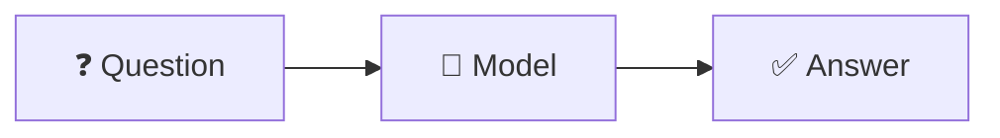
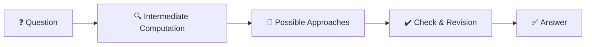
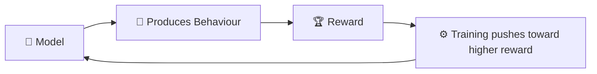
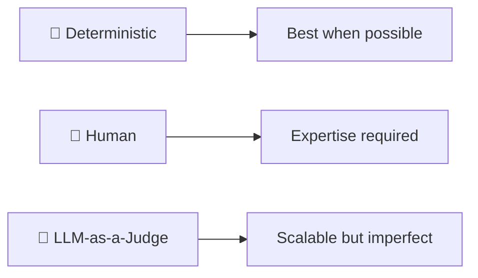

<div align="center">

|                                                   ← Previous                                                   | [⬆ Back to TOC](../README.md#part-2) |   Next →    |
| :------------------------------------------------------------------------------------------------------------: | :----------------------------------: | :---------: |
| [Chapter 8: Base Model to an AI Assistant](../S1%2008%20-%20Base%20Model%20to%20an%20AI%20Assistant/Readme.md) |                                      | Season 2 🔜 |

</div>

---

# Chapter 9 — Can AI Really Think? &nbsp;🧠

> **Season 1** | Part II — Training, Computation & Reasoning | **Season Finale**
> [🎬Link](https://namastedev.com/learn/namaste-ai/can-ai-really-think)

---

<a id="key-topics"></a>

### Topics Covering

> 1. [What Does It Mean to "Think"? — Direct vs Reasoning Generation](#topic-1)
> 2. [Chain of Thought (CoT) & Intermediate Computation](#topic-2)
> 3. [Why Forcing an Answer Quickly Can Hurt](#topic-3)
> 4. [More Computation During Inference — A New Scaling Dimension](#topic-4)
> 5. [Limits of More Computation — Overthinking & Diminishing Returns](#topic-5)
> 6. [Teaching Models to Reason — Reinforcement Learning & RLVR](#topic-6)
> 7. [Three Types of Evaluators & LLM-as-a-Judge](#topic-7)
> 8. [Tree of Thoughts & Graph of Thoughts](#topic-8)
> 9. [Visible Reasoning Is Not Always Faithful](#topic-9)
> 10. [Limits of Reasoning Models](#topic-10)
> 11. [Different Problems Need Different Capabilities](#topic-11)

---

<a id="topic-1"></a>

## 1. [What Does It Mean to "Think"? — Direct vs Reasoning Generation](#key-topics)

Not every task needs the same amount of computation. The episode connects **thinking** with **reasoning**, but distinguishes between two modes of generation.

### Direct Generation

For simple, well-defined tasks, the model can answer immediately.



| Example                        | Why Direct Generation Works                      |
| ------------------------------ | ------------------------------------------------ |
| `5 + 5 = ?`                    | Simple arithmetic — no intermediate steps needed |
| `Translate "Hello" into Hindi` | Straightforward recall and pattern matching      |

### Reasoning-Oriented Generation

For complex or tricky tasks, the model benefits from **intermediate computation** before committing to an answer.



### Example — A Tricky Percentage Problem

_A company grows revenue by 20%, then loses 20%. Is it back to the original?_

```text
Start at 100
→ +20% = 120
→ -20% = 96   ← NOT back to 100!
```

The increase and decrease use **different bases** (100 vs 120), so the result is a net loss. Direct intuition says "back to 100" — reasoning reveals the correct answer is **96**.

> 💡 Simple tasks may need direct generation. Complex or tricky tasks can benefit from **intermediate reasoning before commitment**.

---

<a id="topic-2"></a>

## 2. [Chain of Thought (CoT) & Intermediate Computation](#key-topics)

### Chain of Thought

**Chain of Thought** broadly refers to producing intermediate reasoning steps before arriving at a final answer.


Intermediate reasoning can:

- Improve results for complex tasks
- Give more room for calculation and checking
- Break large problems into smaller subproblems

> **Research Reference:** _"Chain-of-Thought Prompting Elicits Reasoning in Large Language Models"_ — January 2023.

### Intermediate Computation — Worked Example

**Problem:** 23 students each need 4 notebooks. Packets contain 10 notebooks. How many packets?

```text
Step 1:  23 × 4 = 92 notebooks needed
Step 2:  92 / 10 = 9.2 packets
Step 3:  0.2 of a packet cannot be bought
Step 4:  Round up → 10 packets
```

> 💡 **Answer: 10 packets.** Intermediate states preserve dependencies between steps — each step feeds the next, preventing errors from skipping ahead.

---

<a id="topic-3"></a>

## 3. [Why Forcing an Answer Quickly Can Hurt](#key-topics)

Sometimes a model needs computation before commitment. Forcing an immediate answer bypasses the reasoning that would catch errors.

### The Bat-and-Ball Problem

- A bat and a ball together cost **₹110**
- The bat costs **₹100 more** than the ball

```text
Ball = x
Bat  = x + 100

x + (x + 100) = 110
2x + 100 = 110
2x = 10
x = 5
```

| Response Type              | Answer | Correct?   |
| -------------------------- | ------ | ---------- |
| **Quick intuitive answer** | ₹10    | ❌ Wrong   |
| **Reasoned step-by-step**  | ₹5     | ✅ Correct |

The quick intuitive answer of ₹10 is wrong because if the ball costs ₹10, the bat would cost ₹110, and together they would be ₹120, not ₹110.

> ⚠️ Forcing an answer too quickly can bypass the computation needed to catch subtle errors. **Intermediate reasoning prevents premature commitment.**

---

<a id="topic-4"></a>

## 4. [More Computation During Inference — A New Scaling Dimension](#key-topics)

### Inference-Time Computation

```text
Inference = Prompt → Forward Pass → Answer
```

Additional inference-time computation can involve many activities:

| Activity                          | Description                                    |
| --------------------------------- | ---------------------------------------------- |
| **Generating intermediate steps** | Break down the problem into sub-steps          |
| **Exploring alternatives**        | Consider multiple approaches                   |
| **Verifying calculations**        | Double-check arithmetic and logic              |
| **Calling tools**                 | Use calculators, code interpreters, web search |
| **Writing and executing code**    | Solve computationally instead of reasoning     |
| **Evaluating candidate answers**  | Compare multiple drafts                        |
| **Revising a draft**              | Refine initial output                          |
| **Checking constraints**          | Ensure output meets requirements               |

### A New Scaling Dimension

Traditionally, the primary way to make LLMs smarter was to **build a larger model and train it with more compute** (training-time scaling).

Reasoning models open a second scaling dimension:

```text
┌─────────────────────────────────────────────────────┐
│           TWO SCALING DIMENSIONS                    │
│                                                     │
│   1. Training-Time Compute                          │
│      Build larger models, train on more data        │
│                                                     │
│   2. Inference-Time Compute  ← NEW                  │
│      Spend more useful compute solving the problem  │
│      at the time the user asks                      │
└─────────────────────────────────────────────────────┘
```

> 💡 **Training-time compute + Inference-time compute.** How much useful computation a model performs while answering can matter just as much as how much it learned during training.

---

<a id="topic-5"></a>

## 5. [Limits of More Computation — Overthinking & Diminishing Returns](#key-topics)

### More Computation Does Not Guarantee Better Answers

A model can spend more time:

- Exploring the wrong assumption
- Reinforcing an incorrect premise
- Repeating arithmetic mistakes
- Overcomplicating a simple problem
- Selecting the wrong candidate

### The Compute Spectrum

| Level                  | Effect                                                                    |
| ---------------------- | ------------------------------------------------------------------------- |
| **Too little compute** | May answer prematurely — skipping critical steps                          |
| **Useful compute**     | Can significantly improve difficult reasoning                             |
| **Unlimited compute**  | Does **NOT** guarantee correctness — diminishing returns and overthinking |

### Overthinking

Overthinking occurs when the reasoning budget goes **beyond a useful point**. It can produce:

- Diminishing returns on accuracy
- Abandonment of an initially correct solution
- Unnecessary complexity added to a simple problem

> ⚠️ **More thinking can increase the probability of success, but it does not turn probability into certainty.** The right amount of computation depends on the problem.

---

<a id="topic-6"></a>

## 6. [Teaching Models to Reason — Reinforcement Learning & RLVR](#key-topics)

### How Do We Teach a Model to Reason?

The answer presented is **Reinforcement Learning** — the model produces behaviour, receives a reward signal, and training encourages behaviours associated with higher rewards.



### RLVR — Reinforcement Learning with Verifiable Rewards

> RLHF has a weakness: humans are expensive, preferences are subjective, and humans make mistakes. In certain domains, the **environment itself** can tell us whether an answer is correct.

| Domain          | Verification Method                                         |
| --------------- | ----------------------------------------------------------- |
| **Mathematics** | Verifiable final answers — compare output to known solution |
| **Programming** | Execute code and run test suites                            |

#### Programming Example


The result creates a **concrete training signal** — no subjective human judgment needed.

### RLHF — Reinforcement learning from human feedback

> RLHF is a machine learning training technique that uses **human evaluations** to align artificial intelligence models with human values, intent, and preferences.

### RLHF vs RLVR

| Aspect             | RLHF                                     | RLVR                                      |
| ------------------ | ---------------------------------------- | ----------------------------------------- |
| **Reward Source**  | Human preference ratings                 | Environment / automated verification      |
| **Signal Quality** | Subjective, can be inconsistent          | Objective, concrete                       |
| **Cost**           | Expensive (human evaluators)             | Cheaper (automated checks)                |
| **Applicable To**  | Open-ended tasks (writing, conversation) | Verifiable tasks (math, code)             |
| **Weakness**       | Preference bias, fatigue, disagreement   | Limited to domains with checkable answers |

> 💡 Verifiable domains let us reward outcomes with **stronger signals** than subjective human preference alone. DeepSeek-R1 is highlighted as an example of large-scale RL using correctness-oriented signals.

---

<a id="topic-7"></a>

## 7. [Three Types of Evaluators & LLM-as-a-Judge](#key-topics)

After a model produces an answer, we need to evaluate whether it is correct or useful. Three types of evaluators exist:

| Evaluator Type                | How It Works                                                    | Strength                                      |
| ----------------------------- | --------------------------------------------------------------- | --------------------------------------------- |
| **1. Deterministic**          | Exact answer matching, compilers, unit tests, schema validators | Best when possible — objective and reliable   |
| **2. Human**                  | A person inspects the answer                                    | Useful when judgment or expertise is required |
| **3. Model (LLM-as-a-Judge)** | Another LLM judges the output                                   | Scalable but imperfect                        |



### LLM-as-a-Judge — Capabilities

An LLM judge can potentially evaluate: relevance, clarity, instruction following, style, completeness, code explanations, and factual consistency against provided context.

### Problems with LLM-as-a-Judge

| Problem                                | Description                                           |
| -------------------------------------- | ----------------------------------------------------- |
| **Biases**                             | Systematic preferences that skew evaluation           |
| **Length preference**                  | Tendency to rate longer answers higher                |
| **Style preference**                   | Fluent language rated higher regardless of accuracy   |
| **Position bias**                      | Preferring answers based on order of presentation     |
| **Subtle error blindness**             | Inability to detect subtle factual errors             |
| **Persuasive language susceptibility** | Confident, well-written wrong answers rated higher    |
| **Correlated errors**                  | Judge and judged model may share the same blind spots |

### The Recursive Evaluation Problem

```text
Model Answer → LLM Judge → Who evaluates the evaluator? → ???
```

> ⚠️ Using AI to evaluate AI **scales evaluation**, but it does not magically create objective truth. The recursive problem — _"Who evaluates the evaluator?"_ — remains open.

---

<a id="topic-8"></a>

## 8. [Tree of Thoughts & Graph of Thoughts](#key-topics)

### Chain of Thought → Tree of Thoughts → Graph of Thoughts

The reasoning strategy evolves from linear to branching to interconnected:

```text
Chain of Thought          Tree of Thoughts          Graph of Thoughts
─────────────────         ─────────────────         ─────────────────
Problem                   Problem                   Problem
   │                         │                         │
Step-1                    A / B / C                 A / B / C
   ↓                       ↓   ↓   ↓                 ↓   ↓   ↓
Step-2                   Score each                Score each
   ↓                         ↓                        ↓   ↓
Step-3                   Prune weak              Combine best ideas
   ↓                         ↓                     from A and B
Answer                  Continue best                   ↓
                             ↓                        Answer
                           Answer
```

### Tree of Thoughts (ToT)

Instead of committing to one reasoning path, ToT explores **multiple possible paths**:

- Explore several possibilities
- Score partial solutions
- Prune weak branches
- Continue promising branches

> 💡 Branching gives the system **more chances** to find a good solution instead of committing immediately to one path.

### Graph of Thoughts (GoT)

A tree has a limitation: each branch grows **independently**. Reasoning is not always tree-shaped — useful ideas from different paths can reconnect and combine.

**Example:**

- Approach A finds an **efficient algorithm**
- Approach B finds an **important edge case**
- Combined: a solution that is **both efficient and handles edge cases**

> 💡 Graph of Thoughts allows **cross-pollination** between reasoning paths — the best insights from different branches can merge into a stronger result.

---

<a id="topic-9"></a>

## 9. [Visible Reasoning Is Not Always Faithful](#key-topics)

### The Faithfulness Problem

A model may say: _"I first did X, then Y, then Z."_ We assume that is exactly how the answer was produced. But the explanation is **still generated text**.

| What We See              | What Actually Happens                                     |
| ------------------------ | --------------------------------------------------------- |
| Step-by-step explanation | Internal computation across layers                        |
| Clean reasoning chain    | Intermediate latent representations                       |
| Logical narrative        | Hidden system processes                                   |
| Post-hoc explanation     | May be simplified, reconstructed, or partially fabricated |

> ⚠️ Visible reasoning should **not** automatically be treated as perfect evidence of internal causality. Research from Anthropic shows that generated Chain of Thought is **not always fully faithful** to the information influencing an answer.

### Why Some Systems Don't Expose Raw Reasoning Traces

| Reason                  | Explanation                                                  |
| ----------------------- | ------------------------------------------------------------ |
| **Noisy traces**        | Raw intermediate traces may contain abandoned hypotheses     |
| **Confusing for users** | Showing every dead-end path reduces clarity                  |
| **Security risk**       | Exposes system strategies or sensitive internal instructions |
| **Manipulation risk**   | Makes systems easier to reverse-engineer or manipulate       |
| **Conciseness**         | A summary communicates what matters without raw noise        |

> 💡 More transparency is not always more useful. A **concise explanation or summary** can communicate what matters without exposing every raw intermediate trace.

---

<a id="topic-10"></a>

## 10. [Limits of Reasoning Models](#key-topics)

Even with reasoning capabilities, models can still fail in many ways:

| Failure Mode                              | Description                                                          |
| ----------------------------------------- | -------------------------------------------------------------------- |
| **Hallucinate**                           | Generate plausible-sounding but incorrect information                |
| **Arithmetic errors**                     | Make calculation mistakes despite reasoning steps                    |
| **Misunderstand the problem**             | Solve a different problem than what was asked                        |
| **Accept false assumptions**              | Proceed from incorrect premises without questioning                  |
| **Reason correctly from wrong premises**  | Valid logic chain built on a flawed foundation                       |
| **Fail to use tools**                     | Reason manually when a calculator or search would help               |
| **Misuse tools**                          | Use the wrong tool or use the right tool incorrectly                 |
| **Get trapped in one approach**           | Unable to pivot to a better strategy                                 |
| **Overthink**                             | Abandon an initially correct solution through excessive deliberation |
| **Produce convincing but invalid proofs** | Confident, well-structured reasoning that is fundamentally wrong     |
| **Fail on unfamiliar problems**           | Struggle with novel patterns not seen during training                |

> ⚠️ **More thinking ≠ Guaranteed correctness.** Reasoning improves the chance of success, but it does not remove the need for **verification and good tool use**.

---

<a id="topic-11"></a>

## 11. [Different Problems Need Different Capabilities](#key-topics)

The key insight is that not every problem should be solved the same way. Different tasks call for different forms of computation:

| Task                     | Capability Needed            |
| ------------------------ | ---------------------------- |
| Explain a concept        | Language generation          |
| 278831 × 52649           | Calculator / code tool       |
| Current stock price      | Live data / web search       |
| Solve a math proof       | Reasoning                    |
| Summarise an essay       | Generation                   |
| Search private documents | Retrieval + generation (RAG) |
| Debug a program          | Reasoning + code execution   |

> 💡 The real goal is to build systems that know **when to generate, when to reason, when to retrieve, when to search, when to verify, and when to use tools**.

---

### Common Misconceptions

| Misconception                                                           | Reality                                                                                                                                 |
| ----------------------------------------------------------------------- | --------------------------------------------------------------------------------------------------------------------------------------- |
| ❌ "More thinking always means better answers"                          | ✅ More computation **increases probability** of success but does not guarantee correctness — overthinking can even hurt                |
| ❌ "AI reasons the same way humans do"                                  | ✅ AI generates intermediate tokens that can improve results, but this is **not the same as human cognition**                           |
| ❌ "Chain of Thought shows exactly how the model arrived at the answer" | ✅ Visible reasoning is **generated text** and may not be fully faithful to internal computation (Anthropic research confirms this)     |
| ❌ "RLHF is the only way to train reasoning"                            | ✅ **RLVR** uses verifiable rewards (math solutions, code tests) which provide stronger, objective training signals                     |
| ❌ "Reasoning models don't hallucinate"                                 | ✅ They can still hallucinate, make arithmetic errors, misunderstand problems, and produce **convincing but invalid proofs**            |
| ❌ "LLM-as-a-Judge provides objective evaluation"                       | ✅ LLM judges have biases (length, style, position) and create a **recursive evaluation problem** — who evaluates the evaluator?        |
| ❌ "Every task benefits from reasoning"                                 | ✅ Simple tasks should use **direct generation** — different problems need different capabilities (reasoning, retrieval, tools, search) |

---

<div style="font-size: 22px; color: red">
<details>
  <summary><strong>Interview Questions (Click to View)</strong></summary>
  <div style="font-size: 0.9rem; color: black; background:#fff; border:2px solid red; border-radius: 10px; padding: 20px;">

**Q1. What is the difference between direct generation and reasoning-oriented generation?**

**A.** Direct generation produces an answer immediately (Question → Model → Answer) and is suitable for simple tasks like basic arithmetic or translation. Reasoning-oriented generation involves intermediate computation — exploring approaches, checking, and revising — before committing to an answer. Complex or tricky tasks benefit from this additional computation.

---

**Q2. What is Chain of Thought (CoT) and why is it useful?**

**A.** Chain of Thought refers to producing intermediate reasoning steps before arriving at a final answer (Problem → Step 1 → Step 2 → ... → Answer). It improves results for complex tasks by giving the model more room for calculation and checking, and by breaking large problems into smaller, manageable subproblems.

---

**Q3. Explain the bat-and-ball problem and why quick answers can be wrong.**

**A.** A bat and ball cost ₹110 total, with the bat costing ₹100 more than the ball. The quick intuitive answer for the ball is ₹10, but this is wrong — it would make the bat ₹110 and the total ₹120. Setting up the equation: x + (x + 100) = 110 → x = 5. The correct ball price is **₹5**. This demonstrates why forcing an answer quickly can bypass critical computation.

---

**Q4. What is inference-time computation and why is it important?**

**A.** Inference-time computation refers to additional compute spent while the model is generating its response — generating intermediate steps, exploring alternatives, verifying calculations, calling tools, evaluating candidates, and revising drafts. It represents a **second scaling dimension** beyond training-time compute, allowing models to improve performance by thinking more carefully at the time of answering.

---

**Q5. Why does more computation not guarantee better answers?**

**A.** A model can spend more time exploring wrong assumptions, reinforcing incorrect premises, repeating mistakes, overcomplicating simple problems, or even abandoning an initially correct solution through overthinking. More thinking increases the **probability** of success but does not turn probability into certainty.

---

**Q6. What is the compute spectrum (Too Little → Useful → Unlimited)?**

**A.** Too little compute may cause the model to answer prematurely, skipping critical steps. Useful compute can significantly improve difficult reasoning. But unlimited compute does **not** guarantee correctness — it produces diminishing returns and can cause overthinking, where the model overcomplicates or abandons correct solutions.

---

**Q7. How is Reinforcement Learning used to teach reasoning?**

**A.** In RL for reasoning, the model produces behaviour (a response), receives a reward signal indicating quality, and training pushes the model toward behaviours associated with higher rewards. Over many iterations, the model learns which reasoning patterns lead to correct or preferred outcomes.

---

**Q8. What is RLVR and how does it differ from RLHF?**

**A.** **RLVR** (Reinforcement Learning with Verifiable Rewards) uses objective, automated verification — such as checking math answers or running code tests — instead of subjective human preference ratings used in RLHF. RLVR provides stronger, more concrete signals in domains where correctness can be checked automatically, but is limited to verifiable tasks (math, programming).

---

**Q9. What are the three types of evaluators for model outputs?**

**A.** (1) **Deterministic evaluators** — exact answer matching, compilers, unit tests, schema validators — best when possible. (2) **Human evaluators** — useful when judgment or expertise is required. (3) **Model evaluators (LLM-as-a-Judge)** — another LLM judges the output, scalable but imperfect.

---

**Q10. What is the LLM-as-a-Judge approach and what are its problems?**

**A.** LLM-as-a-Judge uses an LLM to evaluate another model's output on dimensions like relevance, clarity, and factual consistency. Problems include: biases (length, style, position), inability to detect subtle factual errors, susceptibility to persuasive language, correlated errors with the model being judged, and the **recursive evaluation problem** — who evaluates the evaluator?

---

**Q11. What is Tree of Thoughts (ToT) and how does it improve on Chain of Thought?**

**A.** While Chain of Thought explores one linear reasoning path, Tree of Thoughts explores **multiple possible paths** simultaneously. It generates several approaches, scores partial solutions, prunes weak branches, and continues promising ones. This gives the system more chances to find a good solution instead of committing immediately to one path.

---

**Q12. What is Graph of Thoughts and how does it extend Tree of Thoughts?**

**A.** In a tree, each branch grows independently. Graph of Thoughts removes this limitation by allowing useful ideas from **different branches to reconnect and combine**. For example, one branch may find an efficient algorithm while another discovers an important edge case — Graph of Thoughts can merge both into a stronger combined solution.

---

**Q13. Why is visible reasoning not always faithful to internal computation?**

**A.** The step-by-step explanation a model produces is still **generated text**, not a direct readout of internal computation. The actual answer involves internal latent representations and hidden processes. The visible explanation may be simplified, reconstructed, or partially post-hoc. Anthropic research confirms that generated Chain of Thought is not always fully faithful to the information influencing an answer.

---

**Q14. Why do some systems not expose raw reasoning traces?**

**A.** Raw traces may be noisy, contain abandoned hypotheses, confuse users, expose system strategies or sensitive instructions, make systems easier to manipulate, and reduce clarity. A concise summary can communicate what matters without exposing every raw intermediate trace.

---

**Q15. List the key failure modes of reasoning models.**

**A.** Reasoning models can still: hallucinate, make arithmetic errors, misunderstand problems, accept false assumptions, reason correctly from wrong premises, fail to use or misuse tools, get trapped in one approach, overthink, produce convincing but invalid proofs, and fail on unfamiliar problems. More thinking improves probability but does not guarantee correctness.

---

**Q16. Why do different problems need different capabilities?**

**A.** Simple explanations need language generation. Large arithmetic needs calculators. Current data needs web search. Math proofs need reasoning. Document search needs retrieval (RAG). Debugging needs reasoning plus code execution. The real goal is building systems that know **when to generate, reason, retrieve, search, verify, or use tools**.

---

**Q17. What is the recursive evaluation problem?**

**A.** When an LLM is used to judge another LLM's output, the question arises: who evaluates the judge? The judge itself can have biases, miss errors, and share blind spots with the model being evaluated. This creates a recursive loop where there is no guaranteed ground truth — using AI to evaluate AI scales evaluation but does not create objectivity.

---

**Q18. Summarise the complete Season 1 journey from data to reasoning.**

**A.** The journey progresses through: AI Evolution → LLMs & Response Generation → Tokens & Embeddings → Transformer Architecture → How Models Learn & Train → Base Model → AI Assistant (SFT, RLHF) → Reasoning (CoT, ToT, GoT, RLVR). The broader mental model is: Data → Tokens → Embeddings → Transformers → Training → Post-Training → AI Assistants → Reasoning.

  </div>
</details>
</div>

---

### Key Takeaways

- **Not every task needs reasoning.** Simple tasks benefit from direct generation; complex tasks benefit from intermediate computation.
- **Chain of Thought** breaks problems into intermediate steps, improving accuracy on complex tasks.
- **Forcing an answer quickly** can bypass critical computation and lead to errors (bat-and-ball problem).
- **Inference-time compute** is a second scaling dimension — spending more useful computation while answering can matter as much as training-time compute.
- **More thinking increases probability, not certainty.** Overthinking can produce diminishing returns or even cause abandonment of correct solutions.
- **RLVR** uses verifiable rewards (math, code tests) for stronger training signals than subjective human preference (RLHF).
- **Three evaluator types:** deterministic (best when possible), human, and LLM-as-a-Judge (scalable but imperfect).
- **Tree of Thoughts** explores multiple reasoning paths; **Graph of Thoughts** allows paths to reconnect and combine insights.
- **Visible reasoning is not always faithful** to internal computation — it is still generated text that may be simplified or post-hoc.
- Reasoning models can still **hallucinate, make errors, overthink, and produce convincing but invalid proofs**.
- The real goal: build systems that know **when to generate, reason, retrieve, search, verify, or use tools**.

---

## Season 1 — Complete Journey Recap 🚀

Across 9 episodes, the journey progressed from the foundations of AI through language models to reasoning:

```text
AI Evolution ──► LLMs & Response Generation ──► Tokens & Embeddings
                                                        ↓
Transformer Architecture ◄────── How Machine Represents Meaning
    ↓
Computational Brains ──► How Models Learn & Train ──► Base Model → AI Assistant
                                                                      ↓
                                   Can AI Really Think? ◄──── Reasoning Models
```

### The Complete Mental Model

```text
Data → Tokens → Embeddings → Transformers → Training → Post-Training → AI Assistants → Reasoning
```

> 💡 Understanding these layers changes the way we look at AI: from simply using AI tools to understanding **what happens behind the scenes** — from data and tokens all the way to assistants and reasoning systems.

---

<div align="center">

|                                                   ← Previous                                                   | [⬆ Back to TOC](../README.md#part-2) |   Next →    |
| :------------------------------------------------------------------------------------------------------------: | :----------------------------------: | :---------: |
| [Chapter 8: Base Model to an AI Assistant](../S1%2008%20-%20Base%20Model%20to%20an%20AI%20Assistant/Readme.md) |                                      | Season 2 🔜 |

</div>
